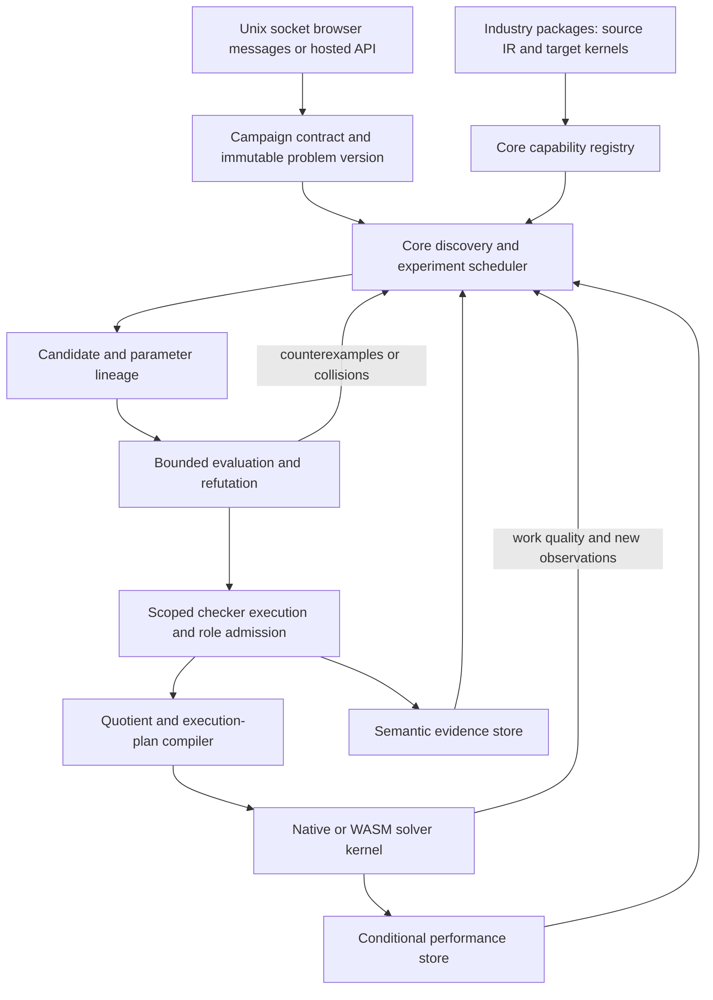

# C1079 — autonomous Ergodis convergence and delivery plan

**Lane**: `ergodis`
**Date**: 2026-09-06
**Status**: draft synthesis under evidence review. This is a recommended architecture and staged
implementation plan, not a source migration, release, IP allocation, or claim of shipping readiness.

## Recommendation

Consolidate around a portable, core-owned campaign engine that discovers candidates, chooses
experiments, refines its representations from counterexamples, validates theorem/parameter
instances, compiles admitted quotients, and measures their actual effect on solving. Keep native
sockets, browser workers, persistence backends, and industry packages as adapters around those
same semantics. Reuse the existing engines and languages; connect them through explicit contracts.

Make industry packages hybrid: source/IR for extensible logic and target-specific executable
kernels for specialized work. A package may carry a native library and a WASM kernel variant,
with one logical capability identity and separately identified target artifacts. Keep QEC-specific
knowledge separable; shared discovery, compiler, control, and validation workflows belong in core.
Ship recipient-run native/browser black boxes first, then hosted access using the same packages
and campaign semantics. Both delivery modes are required. An attractive demo is a milestone,
not evidence that autonomous theorem discovery or all-platform support is complete.

The highest-value first implementation slice is a **portable candidate/parameter/admission contract
connecting an existing proposer to an independently checked bounded reduction and a real solver
consumer**. Recover the C1032 browser baseline alongside it. Starting with obfuscation or a large
plugin loader would leave the central discovery-to-solve gap intact.

## Evidence and limits

The reviewed source snapshots are core `6cc96680c0c3251d094afb9b7b09bf6d1cfc8ce4`, private
`74b7ca9243b143edeb5af58f69f1a55cc7f4a710`, and C1032 branch
`codex/c1032-ergodis-wasm` at `d5a39e5f43e29ca8965dd45dc174b92265fccb65`. The prototype lives in
`/home/tavis/src/othello-worktrees/c1032-ergodis-wasm/papers/complete-repair-ports/ergodis/wasm/`.

| Evidence memo | Coverage |
|---|---|
| `2026-09-06-c1079-core-inventory.md` | Current core evolve, control, proof-status and provenance machinery |
| `2026-09-06-c1079-private-inventory.md` | Private/C1016 extraction, replay, proof rules, and documented campaign behavior |
| `2026-09-06-c1079-research-inventory.md` | Earlier research, especially C985 architecture and spikes |
| `2026-09-06-c1079-roadmap-inventory.md` | Promotion survey, existing evaluation objectives, queued benchmark gates |
| `2026-09-06-c1079-wasm-capability-audit.md` | Recovered C1032 prototype, historical test evidence, current portability limits |
| `2026-09-06-c1079-promotion-ip-analysis.md` | Reusable/private candidates and QEC asset/dependency inventory |
| `2026-09-06-c1079-runtime-ir-analysis.md` | Existing languages/IR, native module seams, host-independent workflow proposals |

These are bounded source/document audits by the parent and user-requested Terra sub-agents.
No source changes, new build, browser run, benchmark, loader, or migration was performed.
Historical measurements/tests remain attributed to their reports; current portability is not
claimed from an old successful build. New architectural recommendations below are explicitly
proposals. No present solver unsoundness exploit was established by this review.

## What exists and what needs convergence

| Component | Current evidence | Recommendation |
|---|---|---|
| Generic evolution | `theorem_search.rs:302,467,1486` supplies a runner-neutral driver and streaming evolution, archives and failure cores | Retain as shared discovery primitives; adapt daemon/spikes to common candidate/event contracts without immediately rewriting both loops |
| Native campaign | `control/evolution.rs:1981` and `control/mod.rs:1404–1745` own bounded low-priority frozen-batch evolution | Retain proposer, niche, replay and budget mechanisms; move campaign semantics behind a portable host interface |
| Source/IR | `control/text.rs`, `control/vm.rs:300–580`, `feature_dag.rs`; text/expression → PlanSpec, typed feature DAG → plan | Reuse scalar policy IR and DAG semantics; extract filesystem-free parsing/lowering/evaluation; add typed theorem/parameter/quotient payloads rather than overloading a field name |
| Proof-status bookkeeping | `semantic_theorems.rs:133–145,227–245`, `provenance.rs` | Retain DAG and status records as bookkeeping; add real checker execution, exact subject/scope binding, and admission decisions |
| Private proof synthesis | `proof_synthesis.rs:220–262,291–321,386–480` binds extractors and replays registered derivations | Promote reusable extractor/derivation/replay contracts; retain selected private rules, recipes, and theorem implementations |
| Typed private recipes/features | `semantic_plan.rs`, feature synthesis/evolve modules and C1016 corpora | Fold reusable operations into core IR/compiler/discovery mechanisms; private names, corpora, policies and theorem selections remain package data/code |
| CEGAR-shaped spike | `tasks/hadamard-2092/src/evolve/theorem_gap.rs:604–639` retains direct-model refutations | Reuse counterexample/admission plumbing; preserve planted-family scope and distinguish it from general abstraction-refinement proof |
| WASM | C1032 exports only bounded GF(2) `solveCompositionJson` in a Web Worker | Forward-port the small adapter to current core and validate it; do not merge the old monorepo tree wholesale or label native evolve browser-ready |
| Runtime industry modules | No native dynamic loader, cross-target industry package contract, or IR kernel import system in inspected implementation | New work at a common package boundary; keep native and WASM loaders target-specific |

Private work is not automatically secret business knowledge: generic synthesis and workflow code
belongs in core even when C1016 produced it. Conversely, promoting an interface is not permission
to copy the private theorem catalogue, training fixtures, tuned policy, or evidence into core.

## Intent reconciliation and priority-ranked findings

**P0 — disclosure/ownership boundary must precede promotion or demo export.** QEC assets span
core CSS/BP-OSD support and private Tiger/DEM/window/predecoder work (promotion/IP memo). Current
location does not establish what has been publicly disclosed or who owns it. Map the release
history and asset dependencies before classifying any item as an exclusive private asset.
This is a planning gate, not a finding that disclosure has occurred.

**P1 — proof admission is not supplied by proof-status bookkeeping.** Public
`IndependentCheck::new(checker_id, digest)` accepts any nonzero caller ID; `record_proved` records
that attestation. It does not execute an independent checker. The `u32` subject/digest is not a
portable cryptographic artifact identity. This is source-reproducible API behavior, not an exploit
of a known consumer. Never let module registration, a decoded `Proved` label, or corpus perfection
authorize an exact reduction. Preserve status records but bind admissions to actual checker runs.

**P1 — mode, origin, and validation are inconsistently expressed.** Private `ProvenanceClass`
contains `ProvedStructural`, `ExactComputational`, `ObservedEvolved`, `HeuristicSearch`, and
`DirectWitness` (`proof_synthesis.rs:299–305`). Core proposal role and VM plan role are separate
again; `PlanRole` only admits diagnostic/ordering (`control/vm.rs:320–323`). No inspected
end-to-end run contract expresses the user’s independent dimensions. Keep existing fail-closed
pruning guards during migration; do not rename `ObservedEvolved` to an authority level.

**P1 — the autonomous loop is partly implemented, not integrated through quotient admission.**
Current daemon evolution exists; claims that it is wholly future work are stale. Current
`DESIGN.md:53–76` still identifies live snapshot ingestion and durable evolution checkpoint/resume
as unfinished. Existing per-corpus perfection and cost proxies do not demonstrate autonomous
selection of admitted quotients by measured end-to-end value.

**P1 — WASM and deployable modules are separate delivery gaps.** The C1032 slice has historical
browser/parity evidence; current core did not retain its adapter. Neither it nor core provides
the requested industry loader. Restoring one export does not port the Unix/fs/thread-dependent
control plane. Current WASM compilation and compatibility still need fresh validation.

**P2 — terminology can incorrectly narrow ambition or overstate guarantees.** Earlier C985
proposal/admission architecture already specifies unattended proposers (`:98–103,229–235`).
Frozen-corpus descriptions describe an implemented arm, not a repudiation of autonomy. Likewise,
a generic ClaimStatus enum is compatible with rejecting a generic `verified=true` admission bit.
Suggested document corrections after architecture approval: qualify implementation status by
revision; state mode-specific permissible use; distinguish source/provenance, evidence status,
and admission; replace diagnostic-only product framing with the broader goal while retaining the
current implementation limitation. Do not attribute correctness to model authorship.

## Proposed portable campaign architecture

One core campaign implementation owns the workflow. Host services supply clocks, durable storage,
bounded scheduling/cancellation, and transport. Native uses the existing Unix-socket protocol and
watcher; browser uses Worker messages and an explicit persistence adapter; hosted access invokes
the same logical operations. Socket path, host clock, or native pointer is not semantic identity.
Expose start/pause/cancel/checkpoint/status, budgets, proposer/target hints, package capabilities,
mode, evidence and approved disclosure views. Steering issues versioned commands; it does not
mutate a frozen problem or rewrite historical lineage.

The autonomous cycle is bounded but recurrent: select unsolved regions/observational collisions;
propose features, theorems, parameter instances, partitions or decompositions; falsify cheaply;
request stronger evidence for promising candidates; compile admitted plans; race against controls;
retain semantic discoveries and conditional performance results; choose the next experiment.
Stop on solved objective, exhausted budget, or explicit pause—not merely one completed population.
The baseline remains an eligible policy; no improvement is a valid result.

From AlphaEvolve, retain the evaluated candidate population and feedback-driven proposal portfolio;
from CEGAR/CEGIS, retain refutation-driven refinement and explicit abstraction/synthesis obligations.
Do not call mutation with a few failing examples a proved CEGAR loop. Candidate-language expansion,
new theorem shapes, and new parameterizations remain possible through typed capabilities and
proposers; a fixed initial catalogue is a bootstrap, not the product limit. External code or LLM
proposals remain untrusted producers and cannot rewrite their own verifier to gain authority.

## Contracts that must be independent

| Record | Proposed contents / invariant |
|---|---|
| Run contract | Goal, proof-generating or heuristic mode, authoritative problem/domain, budget, package set, admitted capabilities, coverage and termination semantics |
| Candidate origin | Human/imported/generated/evolved/composed origin events, exact parent versions, generating operator/proposer/config/input IDs; origin is immutable history |
| Theorem and parameter records | Distinct IDs for theorem statement/schema, parameter schema, each instantiation, scope/side conditions; an evolved parameter is not hidden inside a theorem name |
| Validation evidence | Checked statement/domain, checker implementation/version and execution/input/artifact digests, assumptions, result, independent replay route; finite coverage names the full finite domain |
| Admission decision | Particular capability/role + problem version + parameter instance + obligations + checker evidence; availability or status alone never implies admission |
| Compilation record | Source/language/options/compiler/IR IDs, resolved kernel identities, target and workspace requirements; exact artifact digest separate from source semantic identity |
| Confidentiality/use record | Asset/industry association, allowed consumers/disclosure view and explicit decisions; separate from origin, truth status and proposed legal owner |
| Performance record | Build/target/hardware/input distribution/protocol/budget, work/quality/cost, censoring and paired controls; a performance prior can expire without deleting a counterexample |

Use strong content digests for portable records; retain small local IDs for efficient in-memory
DAGs. A hash provides identity, not truth or ownership. Reuse existing ancestry and evidence rather
than erasing it during schema migration. Legacy artifacts get explicit legacy/unknown fields;
unknown provenance cannot be silently upgraded by filling invented origin data.

**Mode transitions:** changing a run mode creates a new run epoch/branch with an explicit coverage
ledger. Heuristic restrictions may find valid witnesses, which can be checked independently, but
cannot establish absence/optimality over discarded regions. Entering proof-generating mode must
revalidate each effective reduction and cover excluded regions or restart from a complete frontier;
toggling a flag cannot repair prior omissions. Proof-generating runs may use heuristic ordering or
proposal selection when all claimed coverage/reduction obligations still hold. A finite exhaustive
check can be sufficient proof for its entire declared finite problem; generalization beyond it
needs its own evidence. Private or evolved origin never disqualifies an otherwise checked theorem.

**Mutation and composition:** changing source, parameters, scope, checker, kernel semantics, or
compiler creates a new identity. Reuse evidence only through a checker-specific preservation
argument or fresh replay. Composition carries the premises’ scopes, side conditions and disclosure
restrictions; neither weakest-premise status alone nor a DAG edge establishes applicability.

## Choosing quotients and incorporating the spikes

Correctness, requested role, resource bounds and permitted use are admission constraints, not
terms traded against speed. Among eligible candidates retain a frontier over discovery and
validation cost, compile/load cost, states/transitions removed, kernel evaluation cost, memory,
reuse horizon, and downstream composability. In heuristic mode also price witness quality and
success probability under a declared budget; heuristic scores cannot become proof-mode exclusions.

Measure total task cost: proposal + validation + compile/load + solve + required replay. An
amortized view may divide reusable setup by an explicit expected reuse count; also report the
cold single-use result. Use identical root/stratum inputs, budgets and output obligations for
paired races; keep timeouts censored. Report no-win and clean-miss controls. “Optimal quotient”
means best observed admissible choice under this objective unless a bounded exhaustive comparison
or theorem establishes optimality over a stated candidate family.

Fold the following into the core workflow, preserving narrow evidence:

- C985 exact falsification, outcome-class/niche archives, hard-example replay, typed proposer
  sessions and resource policies: already present; join them before adding a new scheduler.
- C985 scope-as-genome, paired root races, separate semantic/performance stores, and snapshot/WAL
  design (`2026-08-30-c985-ergodis-adaptive-search-learning-adr.md:63–235`): finish the missing
  integration, using immutable presentation transitions and persisted restart state.
- Private registered extraction/Horn replay and typed semantic recipes: extract reusable contracts
  and feed the existing DAG/IR; selected proof rules and tuned recipes remain private modules.
- Generic relational/symmetric/feature synthesis and contextual scope/projection machinery:
  port or adapt genuinely missing reusable operations after comparing core equivalents; retain
  private training corpora and theorem choices. Do not require a wholesale private directory move.
- The theorem-gap spike: use its bounded direct-model counterexample/admission story as the first
  discovery-to-solver acceptance fixture. C1039’s planted result is a controlled demonstration,
  not general blind-discovery evidence. C1045/C1046 already own transfer/composition evaluations.
- C1016 quotient ladders and the zero-cost-witness memo: use them to validate parameter binding,
  scoped exclusion, downstream-aware selection and cold validation. Keep specialized static
  adapters fast; replace them only if a measured generic path meets the performance contract.

Retire duplicated persistence formats and manual replay drivers only after consumers migrate and
replay passes. Retain the old drivers as controls meanwhile. No new generic engine should coexist
indefinitely with an equivalent older one merely because a spike has a different vocabulary.

## Hybrid packages and host execution

Recommend a versioned logical manifest: package/capability IDs, dependency and core/IR version
ranges, source/IR and target artifact digests, role/shape/parameter contracts, workspace bounds,
checker dependencies, available host profiles, and disclosure/use metadata. A package may contain
source for runtime compilation, prepared IR for distribution, and one or more kernel artifacts.
A semantic identity survives target lowering; each target implementation still needs its own
identity, compatibility checks and required parity evidence.

**Source/IR:** start with current text/PlanDocument/FeatureDag lowering for scalar policy and
features. Add typed structural payloads for theorem schemas, parameter domains, exact reductions
and quotient plans. Do not pretend PlanSpec’s scalar opcode set already represents those.
Extract pure lowering/evaluation from filesystem/control dependencies. Runtime compilation is
cold, resource-bounded, and reproducible; demo builds may prepare opaque IR in advance. Generated
source and private imports remain in internal records, not automatically in user-facing diagnostics.

**Native kernels:** recommend a small versioned C ABI with cold registration, fixed-width
metadata, opaque handles, explicit buffer ownership/capacity/error rules and no Rust-owned
containers or unwinding across the boundary. Load and resolve before campaign execution; pin a
module while compiled plans refer to it. Defer live unload/replacement. Invoke a coarse batch,
root or solver entry so the specialized kernel owns its hot loop; do not add a loader/trait/FFI
lookup per state. Control updates occur only at measured safe points. Dynamic libraries are a
packaging boundary, not an isolation boundary; exact consumers must name their trusted checker
and kernel obligations. Untrusted proposal execution can use a separate process/host capability.

**Browser WASM:** restore the C1032 adapter against current core, then add the portable compiler
and campaign step API in a Worker. Use the same package manifest with WASM kernel variants,
explicit imports/exports, bounded memory/buffers and coarse calls. Recommend an ordinary module
instantiation/host-binding pilot before committing to a component-model or toolchain-specific
side-module architecture. The browser cannot use the native Unix socket path as its transport.
A missing kernel variant returns an explicit capability error; no silent cloud fallback or weaker
validation. Keep browser parallelism a later measured gate; the first parity target is sequential.

**Host-independent workflows:** a cooperative bounded-step engine can run in the native daemon
or a browser Worker. Input snapshots, cancellation/checkpoint safe points and deterministic event
ordering must not depend on native threads. Storage adapters preserve the same logical records;
concrete filesystem WAL and browser persistence are different implementations. Hosted delivery
wraps these operations in authenticated remote access, with separate resource and data policies.

## Industry IP and QEC separation

Keep general compiler/discovery/replay interfaces in core. The leading private QEC package nucleus
is DEM parsing and model adapters, TigerBlossom/specialized decoder kernels, syndrome/window and
predecoder policies, tuned parameters, fixtures, benchmark generators and private evidence. Core
already has CSS and BP/OSD machinery; classify those explicitly rather than pretending the whole
industry implementation is presently isolated or private.

Produce an asset/import/disclosure map before movement: current repository/revision, upstream
provenance, publication history, core dependencies, intended package, proposed permitted use and
unresolved ownership questions. A carve-out acceptance gate is independent build/test/deployment
against a versioned core SDK, with no dependency on unrelated private industry packages, plus
explicit core access/licensing questions for business/legal decision. Do not infer patentability,
inventorship, ownership or derivative-work status from repository paths or generated ancestry.

Track cross-industry input use conservatively in internal lineage. Candidate archives, learned
policies, parameter recipes, theorem compositions and generated source can carry private inputs
across packages. Record those inputs and require an explicit reuse/disclosure decision when a
boundary is crossed; changing a truth status or compiling to IR must not remove the association.
Technical policy is not an automatic legal conclusion. A module can be available locally while
its source, parameters or proof details are excluded from a particular demo view.

## Shippable and hosted black-box demos

| Delivery | Concrete proposed bundle | Acceptance boundary |
|---|---|---|
| Recipient-native | One core binary + approved native kernel libraries + opaque/precompiled IR + compatibility/asset manifest | Runs on declared clean target with hosted access disabled; rejects mismatched dependencies; meaningful results and documented limitations |
| Recipient-browser | Static app/Worker + current core WASM + approved WASM kernels/opaque IR + manifest | Locally deployable HTTP-served bundle, documented browser targets, current parity/smoke evidence, no mandatory remote solve; hosting files is not hosted computation |
| Hosted | Same package/capability identities in managed workers behind a bounded authenticated API | Remote job isolation/resource limits, explicit data retention and approved output view; parity with the corresponding local semantic cases |

For both kernel and IR paths: minimize exported symbols, remove debug/source-path/source-map and
unneeded string/metadata payloads, ship only required assets, and avoid plaintext theorem source
or private training data unless explicitly chosen. Evaluate additional obfuscation against actual
artifact inspection, performance and reproducibility; do not start with bespoke encryption or
claim embedded keys make recipient-controlled execution secret. Record residual recoverability.

Apply disclosure views at the source of output: socket/status API, browser messages, source/IR
inspection, logs/errors, temporary files/caches, candidate archives and proof/replay exports.
Keep a full internal audit record. A recipient view may expose a checked witness, aggregate
metrics and public checker while withholding internal search recipes; whether that is possible
must be tested for each capability. If evidence needed for independent replay is withheld, label
the result accordingly. Black-box packaging must not counterfeit a public proof claim.

The demo should show a baseline, autonomous proposals/refutations, an admitted scoped improvement,
measured solve work and a checked result, plus steering and restart. It must also show a negative
control where evolve cannot improve or cannot certify a candidate. A planted generic fixture is
honest first evidence; a separately approved QEC example establishes industry relevance later.

## Staged implementation and acceptance

Stages below are recommendations, not newly allocated tasks or approval to migrate code.
Existing C1032, C1031/C1033, C1017, C1039/C1040/C1041/C1045/C1046 and C1061 ownership must be
reconciled before assigning duplicate work. C1039 is closed evidence; the other cited tasks’
current states should be read from exact queue rows at dispatch.

| Stage | Concrete output | Dependencies and acceptance |
|---|---|---|
| 0. Preserve and recover | Current source/revision map, QEC asset/import inventory, forward-port plan for C1032, maintained browser build target | No wholesale historical merge. Fresh default-core WASM check, existing eight-case semantic parity and browser smoke before claiming restored support; coordinate with C1032 |
| 1. Contracts and one admitted loop | Portable run/candidate/theorem/parameter/validation/admission records; existing proposer → direct-model check → compiled consumer | Reject forged status, wrong parameters/scope/checker, replay drift and heuristic negative-coverage upgrade. Use C1039 fixture plus a clean-miss/control; no plugin needed to prove the contract |
| 2. Portable compiler and workflow | Pure text/DAG/IR library, candidate roles, bounded campaign stepping, host services and durable semantic/performance records | Native/Worker same candidate semantics; deterministic checkpoint/restart; budget/cancel and corrupt/mismatched restore tests; live snapshots off hot path |
| 3. Package contracts and native pilot | Core-only executable and one external package with both native kernel and source/IR paths | ABI/dependency/resource errors fail explicitly, workspace ownership/lifetime tests, no hidden private core dependency; cold compile/load + warm solve accounting |
| 4. WASM package parity | Same logical package with WASM kernel variant and source/IR support in recovered Worker | Same bounded exact results, witnesses, parameter semantics and admission decisions across targets; explicit missing capability; no per-state JS bridge |
| 5. Autonomous refinement and value | Persistent refutations, scoped features, theorem/parameter mutation, quotient competition, paired feedback, reusable validated discoveries | One no-human-steering campaign runs through multiple refinements/restart; holdout failures refine rather than promote; states/compile/solve/replay/censoring controls, transfer/composition reuse existing tasks |
| 6. Recipient-run demo release candidate | Clean native package and locally deployable browser package, opaque approved payloads, disclosure views, manifest, instructions | Clean-target install/run with remote solve unavailable; native+IR+WASM capability tests, output/artifact inspection, verified result or explicit evidence limit; QEC payload selected separately |
| 7. Hosted demo and industry separation | Authenticated bounded service using same capabilities; independent QEC package build/test/deploy recipe | Same semantic fixtures and approved outputs as local; retention/resource/access tests; core SDK dependency and asset map sufficient for technical separation review |

Stages 0 and contract design can proceed together; package ABI and irreversible source movement
wait for contract/ownership decisions. A first honest local demo can ship after stage 4 with its
limited autonomy labelled; the requested autonomous-system demo requires stage 5 too. Both delivery
modes remain acceptance items, not an excuse to substitute hosted execution for local delivery.

All solve-impacting implementation keeps the existing allocation-free, iterative, presized,
contention-free worker contract. Run the core’s required fmt/clippy/tests and exact differential
replay; hot changes additionally need retained interleaved hardware-counter A/B in single and
parallel modes, memory and contention evidence. Browser validation has its own semantic/resource
and browser-run gates; native performance numbers do not certify browser performance. No new
performance claim is made by this document.

## Decision register and completion boundary

Recommended choices for the user’s review: portable core workflow and typed records; preserve
existing scalar IR with structural payloads above it; versioned C ABI at coarse native kernel
entries; WASM module variants with host bindings; startup/campaign-boundary loading and no live
unload initially; QEC private package as the first industry boundary; recipient-run demos first
with hosted delivery using the same contracts. These are concrete recommendations, not implemented
architecture changes. ABI layout, exact browser mechanism and industry asset disclosure need
review at their respective gates rather than a blanket approval of every later detail.

The architecture/review task can close when its evidence and recommendations pass review. Source
migration, prototype restoration, implementation, packaging, public release and IP transactions
are downstream work. No extra task IDs are allocated merely to duplicate the existing queue.

## Sources and closeout

Primary technical references consulted on 2026-09-06 supplement the local evidence:

- Rust dynamic system libraries and their platform outputs:
  https://doc.rust-lang.org/reference/linkage.html
- Rust FFI ownership/callback/unwind considerations:
  https://doc.rust-lang.org/nomicon/ffi.html
- Bare WASM target limitations (`std::fs`, ordinary thread spawning) and distinction from WASI:
  https://doc.rust-lang.org/stable/rustc/platform-support/wasm32-unknown-unknown.html
- WebAssembly modules/imports/exports and host integration:
  https://webassembly.github.io/spec/core/intro/overview.html
- AlphaEvolve’s proposal/evaluation/population loop:
  https://deepmind.google/blog/alphaevolve-a-gemini-powered-coding-agent-for-designing-advanced-algorithms/

These inform the proposed boundaries, not a claim that a toolchain/plugin option is already
implemented. CEGAR/CEGIS lineage is grounded in the recovered C985 literature/synthesis reports;
no new novelty or prior-art absence claim is made.

**Closeout review:** pending adversarial review of source-supported recommendations and requirement
coverage. Outstanding evidence gaps are current-revision WASM builds, real admission/consumer
integration, prototype-to-core migration, module parity/performance, disclosure history and actual
package inspection. Each has a stage gate above; none is silently treated as completed.
