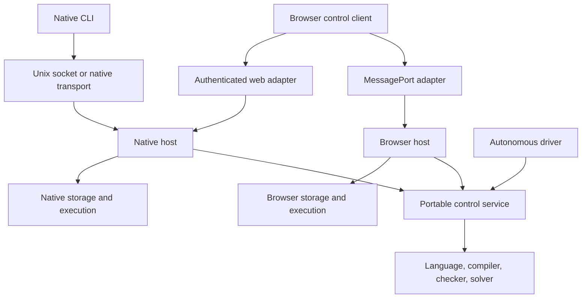

# C1084 — Portable control architecture for native and browser Ergodis

Date: 2026-09-07. Lane: ergodis. Status: design complete; implementation staged below.
Source baseline: core `6269cd1`. Planning/documentation only; no runtime changes or new
platform-support claims. User authorized architectural judgment and asked for maintainability,
extension and Ousterhout-style depth. Terra reviewers independently inspected legacy control
coupling and current browser/campaign behavior; the parent reconciled their findings here.

## Decision

Build one portable control service with a small command/event contract. Run it inside either a
native host or a browser Worker. A common browser client selects a local WASM host or a remote
native host explicitly. The engine owns meaning; hosts own execution and effects. Unix sockets
remain an excellent native transport, but are not the control abstraction.

The autonomous driver uses the same service as human steering. It continues without an attached
UI, subject to the host's lifetime and resource policy. Browser execution cannot promise
unattended continuity after a tab is closed or suspended; durable native hosting provides that.
Never silently move a local workload to a server or change its proof/heuristic mode.



This is a dependency/ownership diagram; local and remote hosts run separate service instances.
Start with modules, not a workspace of tiny crates. Split a crate only when dependency isolation,
release ownership or a real second consumer warrants it. Keep a few deep modules whose interfaces
hide substantial work, rather than passing every operating-system call through a trait.

## Frontend and kernel/session split

Adopt the user's notebook/kernel analogy explicitly. The frontend owns presentation, editable
inputs and views. The repository owns durable campaigns and operation history. A live session owns loaded packages,
resource policy and execution handles for the campaigns it has activated. Compute workers execute
jobs for that session. Distinguish the session runtime
from the specialized mathematical kernels already called kernels in Ergodis; use `SessionHost`
in API names to avoid that collision.

A native session may outlive all frontends. A browser-local session is initially tab-bound; closing
or refreshing its owner requires restoration from its last committed checkpoint. Do not promise
a ServiceWorker or SharedWorker supplies a durable background daemon. A future Jupyter frontend
can attach through an adapter without importing Jupyter or ZeroMQ into core/runtime.

Borrow the useful separation of commands, observation and urgent control: Jupyter supports
multiple frontends and a separate control channel to avoid waiting behind execution requests.
[Authoritative Jupyter messaging](https://jupyter-client.readthedocs.io/en/stable/messaging.html).
For Ergodis, use separate bounded queues and scheduling priority for stop/status, with large
artifact transfers off the control stream. Logical channels can share a transport initially;
separate connections become necessary if measurement shows unacceptable transport head-of-line
blocking. A second channel alone cannot interrupt a synchronous computation; the job boundaries
below still apply. Heartbeat means the session is reachable, not that search is progressing.

Add attach/detach and discovery of existing sessions to the host facade. Reconnection requests a
snapshot and events since a cursor. Multiple frontends may observe; steering requires an explicit
grant and expected-revision checks. Initial policy permits one steering lease plus observers;
lease expiry/revocation does not cancel an autonomous campaign unless the configured run policy
says so. Human and autonomous requests still serialize through one campaign owner. No hidden
notebook cell ordering or mutable UI variable determines solver truth.

A notebook cell can submit a typed problem/goal, start an operation and render progress, evidence,
counterexamples and artifacts. Its output records campaign ID, operation ID, revision and artifact
references. Re-running a cell is a new request unless explicitly retrying the same operation.
Saving notebook output does not save a live continuation or certify a theorem. Exported campaign
checkpoints/artifacts carry the reproducibility contract. A Jupyter adapter is an extension after
the shared client works, not a dependency of the first browser demo.

## Daemon, durable history and reopening work without live processes

The workspace repository, not the daemon process, is the durable center of the product. Default to
one native daemon per user/workspace repository, with multiple active campaigns and isolated jobs.
Do not require one daemon per campaign or a machine-global singleton. Separate repositories may
have separate daemons, and a frontend may attach to several endpoints explicitly. This is local
ownership, not a distributed scheduling/consensus project.

The daemon presents both live control and a durable catalog. Its supervisor owns active session
handles, worker lifecycle and admission to host resources; its repository service owns history
queries. Browsing stored work must not instantiate a Campaign, load private executable modules,
run a checker, replay a solve or allocate a solver workspace. A standalone viewer can use the same
read-only repository API against an exported bundle or local store with no daemon at all. A browser
can therefore open a historical demo offline even when its original native processes are gone.

Keep durable and ephemeral identities explicit:

| Entity | Lifetime and purpose |
|---|---|
| Repository/workspace | Durable namespace and access boundary; indexed catalog is rebuildable |
| Campaign | Durable evolving investigation with goals, candidate/evidence lineage and budget history |
| Solve/run | An immutable execution specification and append-only history, standalone or campaign-linked |
| Execution attempt | One activation/recovery of a run on a host; new identity after restart |
| Certificate/artifact | Immutable content identity, provenance and verification records; may be imported without a run |
| Live session/worker | Ephemeral attachment/execution handle with ownership generation; PID/socket are host diagnostics |

Artifact presence, historical outcome and live availability are independent dimensions. An old
completed solve remains completed when its process exits; an old certificate remains browsable
when its producing campaign is unavailable. A run recorded as Running but with no reconciled owner
is Unreconciled/Interrupted as appropriate, not silently Completed, Failed or definitely still
running. A timeout alone is not proof that a remote worker died. Verification displays historical
checker results separately from verification performed by the current host and checker version.

The frontend's entry point is a workspace view with active work and searchable history. Opening
an item presents the last committed snapshot, lineage, results, certificates and capability status.
It offers explicit actions according to the stored material:

| Action | Meaning and prerequisites |
|---|---|
| View | Read bounded metadata/artifacts; no live process or solver dependencies required |
| Attach | Connect to a currently owned live session; never starts duplicate work |
| Verify | Run a selected available checker over a certificate; add a new verification record without rewriting the old claim |
| Replay | Reexecute stored inputs/commands under identified semantics and compare outcomes; uses a new attempt and physical-work budget |
| Resume | Activate an existing campaign at a committed boundary or compatible persisted continuation; preserve lineage and logical spend |
| Fork | Create a new campaign/run derived from an old artifact/checkpoint with explicit changes, parent links and its own budget |

A certificate is not necessarily a checkpoint. An old manifest and logs may support viewing but
not replay. A replay document may reconstruct campaign state but cannot restore an unpersisted
search stack. The current Campaign v1 supports reconstruction by bounded replay, not mid-solve
continuation; its Resume command only reopens the cancelled gate. The new host-level resume action
must describe which of these mechanisms it will use rather than overloading the existing command.

Provide a bounded resume/replay preflight returning required inputs, exact package/compiler/checker
identities, schema/target compatibility, available checkpoint kind, outstanding reservations and
estimated/limited recovery work. Missing private modules, unsupported historical schemas or absent
inputs return specific reasons; they do not block basic viewing. A change of problem, goal semantics,
mode or incompatible implementation creates an explicit fork/migration artifact instead of
silently continuing the old run. Completed runs remain immutable historical executions; further
exploration becomes another run or a fork within the appropriate campaign lineage.

On activation, acquire repository ownership atomically and mint a new fencing generation before
launching jobs. Publication requires both the expected repository generation and current owner
fence, preventing an old daemon/worker from publishing after replacement. The repository adapter
must implement this transaction/lock guarantee; an in-memory daemon registry or PID-file check is
insufficient. Restart first reconciles durable reservations and attempts, reattaches only through
a valid worker identity handshake where supported, and marks unresolved work explicitly. Do not
unconditionally rerun every historical Running entry. Duplicate activation is rejected or attaches
to the existing owner; it never silently creates a second spender.

A graceful stop supports detaching the frontend, stopping a campaign and shutting down the daemon
as different operations. Document whether workers drain, checkpoint or are interrupted during
shutdown. Reserve budgets before launch and never refund ambiguous crashed work automatically.
Checkpoint retention and garbage collection must follow reachable campaign/run/artifact references,
not process liveness. Deleting a live handle must not delete historical evidence.

Implementation belongs in the existing planned portable runtime (catalog/session supervision
policy), repository (durable records/index/ownership publication) and host (processes/locks). No new
crate is needed solely for historical viewing. Typed versioned historical readers may preserve an
unsupported old document for display without making it executable. Read projections and pagination
keep opening a large history cheap; rebuild indexes off the solve path. No history indexing,
heartbeat or catalog traffic enters a solve hot loop.

Stage 2 defines durable IDs and separates host resume from Campaign Resume. Stage 3 includes
opening an exported historical bundle without a live worker. Stage 4 adds paginated catalog,
read-only offline access, activation fencing and crash reconciliation; stage 5 implements actual
continuation/recovery capabilities. Add acceptance cases for a completed run without processes,
an orphaned in-progress run, a certificate without its producer, unavailable private packages,
viewing without executing, competing activation, stale-owner publication and replay/fork budget
separation. Preserve the same workflow across browser, TUI, notebook and Python clients.

## Present state and what must change

- `src/campaign.rs` is already default-feature portable state: synchronous `new`, `apply`,
  `snapshot`, `checkpoint_json`, `restore_json`. Its bounded schema-1 replay reexecutes checks
  and solves; it does not deserialize admission authority. Cancel gates subsequent commands,
  preserves spend/evidence and does not interrupt an active call.
- `src/control/mod.rs` combines protocol, policy, filesystem, Unix socket transport, threads and
  service lifetime. Its Manifest mixes run/presentation identity with paths and PID. Request
  uses string operations, JSON values, a u64 request ID and a usize byte limit. A transport trait
  alone cannot make this module portable.
- Scalar text/VM and much proposal policy are logically reusable, but remain under the optional
  Unix-coupled control module. `FeatureBatch::read_jsonl` also opens files. Move ownership;
  do not describe these APIs as already available to default-feature WASM.
- `src/control/client.rs::PlanArena` has a valuable existing boundary: refresh performs I/O and
  compilation, then exposes immutable compiled evaluators. Preserve that boundary and its failure
  behavior: stale or failed replacement leaves the active arena intact.
- `wasm/src/lib.rs` exports composition/reduction JSON functions; `wasm/www/worker.js` calls them
  synchronously. There is no campaign export, persistence or extension loader. The main-page
  promise timeout does not stop the work. Existing browser evidence is Chromium on this Linux
  host; it is not Windows/macOS/Firefox/Safari validation.
- Native stores use Unix permissions and O_NOFOLLOW; evolution owns archive I/O and thread priority.
  Cargo currently ties both control-plane and parallel features to libc. Separate portable
  parallel execution from target-specific affinity/priority policies, auditing actual uses.

Prior decisions remain: C1079 convergence/IP plan; C1080 admission; C1081 language inventory;
C1082 scalar semantics; C1083 campaign semantics. This plan advances host separation ahead of the
previously proposed autonomous-driver wiring; it does not replace those semantics.

## Module boundaries and maintenance rules

| Module | Owns and hides | Must not know |
|---|---|---|
| Language/compiler | Typed documents, validation, canonicalization, lowering, executable semantics | Paths, sockets, JS objects, scheduling |
| Verification | Typed mathematical claims, independent checking, scoped records and opaque verified results | Solver machinery, search mode, provenance policy, host/runtime state |
| Campaign | Candidate revisions, evidence, budgets, result coverage, deterministic transition rules | Transport identity, OS handles, browser lifecycle |
| Control service | Session lifecycle, bounded dispatch, operation tracking, authorization decisions, event cursors | Unix APIs, browser promises, storage layout |
| Repository | Typed, integrity-checked immutable artifacts and atomic publication of campaign generations | Theorem truth, solver workspace layout |
| Execution host | Job lifetime, resources, platform capabilities and completion delivery | Authority to bypass admission |
| Adapters | Wire framing, endpoint authentication, storage implementation, platform integration | A second implementation of campaign rules |

Use concrete typed inputs and a small closed set of effects at the service boundary. Do not build
a general effect interpreter, VFS, universal network stack, generic actor framework or plugin
framework for individual opcodes. A service may synchronously return ready events plus bounded
requests for work or persistence; the native runtime or browser event loop completes them. Rust
async executors and JS Promises stay in hosts. Pure transitions receive explicit observations,
not hidden wall-clock reads or randomness. The autonomous proposer records its seed and chosen
inputs; clocks enforce host deadlines separately from reproducible logical work budgets.

A useful API shape is `dispatch(request)`, `snapshot(campaign)`, and private host completion
entry points. These are design sketches, not a frozen Rust API. External clients must never be
able to submit an internal completion that installs an Admission. Effect enums remain specific
to actual operations; extend them when a second use case demonstrates the need.

Keep stable compatibility reexports for moved public Rust APIs. Preserve old native wire behavior
through an explicit legacy adapter; do not silently reinterpret experimental-v0 operations as new
campaign semantics. Document which legacy operations have migrated. Retire each compatibility
path only after its consumers move and its replacement parity tests pass.

## Existing frontend/client work to consolidate

These are source/research reuse inputs, not greenfield feature requests. C1031 and C1033 remain
open under their existing lane rows; this plan neither closes nor absorbs their remaining scope.
Older notes still carry complete-ports pegs; the live ergodis lane routing is authoritative.

| Existing work | Evidence/source | Disposition |
|---|---|---|
| C1031 web console and TUI research | `2026-08-31-c1031-ergodis-visualization-report.md`, architecture/data-model companions, `2026-09-01-c1031-console-red-team.md`; console branch `c1031-ergodis-viz`, worktree `/home/tavis/.cache/c1031-ergodis-viz`, `tools/c1031-viz` | Reuse lineage, archive, scope/cascade and telemetry-availability views; adapt the run reader to service snapshots/events. TUI gets the same read model and session client. |
| C1033 notebook integration | `2026-09-01-c1033-ergodis-jupyter-sage-duckdb.md`; current private `python/ergodis_notebook/{control,campaign,solve,plan,monitor}.py` and `analysis/check_notebook_integration.py` | Reuse attach/launch/watch/steer UX and integration scenario. Replace duplicate Unix framing with shared Python client; move expression lowering into core; keep notebook rendering and private data outside core. |
| Core control Python binding | `python/ergodis_client.py`, `python/test_ergodis_client.py` | Existing reference for experimental-v0 control; preserve strict bounded framing/identity/error tests and proposal DTOs, extract Unix paths/socket/artifact staging behind native adapter. It is not the old math SDK. |
| Older packaged Python math client | `python/ergodis/client.py`, `python/ergodis/_rpc.py`, `python/tests/test_client.py` | Narrow subprocess JSON-RPC GF/character-sum SDK; no campaign API. Preserve or deprecate deliberately after consumer inventory; do not promote its unbounded readline/process behavior into the new control client. |

The C1031 report confirms a separately delegated terminal prototype and shared baked-payload
opportunity; this bounded pass found the console worktree but did not recover the separate TUI
source artifact. Recover that exact artifact through the report/session lineage before rebuilding
or replacing it. The plan does not claim the TUI was inspected or revalidated. Current notebook
source still uses AF_UNIX and experimental-v0; historical notebook end-to-end results are evidence
of prior capability, not current cross-platform acceptance.

C1031's red-team work found missing Bool handling and arithmetic-overflow drift in its independent
JavaScript VM. Reuse those adversarial cases, but use the shared compiled WASM evaluator for the
production browser trace/evaluation path when the portable language extraction lands. Keep an
independent Python/reference checker for conformance, not another unchecked production language
implementation per frontend. Notebook expression builders may construct typed syntax; they should
not maintain their own authoritative lowering/limits. C1033's bytecode-only legacy endpoint remains
an adapter constraint until migrated, not the new service contract.

Preserve the visualization lessons: missing telemetry is unknown rather than zero; rejection
populations have separate denominators; scope and coverage are explicit; truncated live records
must not silently become authoritative data. A legacy run-directory reader may display damaged
records diagnostically, but repository recovery must not accept them as committed campaign state.
Read-only DuckDB catalogs and private Sage checks remain analysis adapters over exported artifacts;
they do not become runtime dependencies or admission authorities.

Introduce one documented Python `SessionClient` API with local/remote transport selection and a
shared error/capability model. The notebook package depends on it, not vice versa. Preserve math
SDK names separately to avoid suggesting `ergodis.Client` already controls campaigns. Stage 2
freezes shared fixtures and adapter interfaces; stages 3–4 migrate the notebook/control client and
TUI consumption incrementally. Do not shell out to `ergodisctl` from each new frontend or expose
server-local artifact paths to a remote client. User-requested Python modernization is a named
migration deliverable, with old/new protocol compatibility tests, not an incidental cleanup.

## Independent verification bounded context

Verification is a separate bounded context with a leaf implementation that does not depend on
the solver, orchestration or host crates. Its job is to check a precisely typed mathematical claim
against authoritative inputs and supplied evidence within a declared budget. Solving discovers
answers and proposes evidence; verification checks the claim. The orchestrator records outcomes
and selects policy but cannot mint a verification capability from a receipt or status field.

Implemented in C1086 (core `08221f2`; report `2026-09-07-c1086-independent-verification.md`):
the fixed finite GF(2) coordinate-restriction checker is extracted into `ergodis-verify`,
with a bounded `binary_composition` module. Keep only primitive typed problem/claim representations,
canonicalization/identity, direct arithmetic, scoped records, replay and opaque verified tokens.
Do not move origin, run metadata, search mode, discovery policy or private-module loading into
this crate. Core admission adapts native matrices/cost tables to the verifier and consumes the
opaque result at a cold execution boundary. Verifier input validation must be independent of a
solver constructor having supposedly checked the same input already.

For this first cut, the small mathematical contracts can live beside the checker. Create a
separate contracts crate only when additional independent consumers/families justify it; do not
create a generic certificate/plugin framework to move one existing checker. The verifier can be
built/tested for native and WASM without compiling the solver. Its normal dependency closure must
contain no solver, runtime, Rayon, platform-control, filesystem or module-loader dependency.

| Claim kind | Required distinction |
|---|---|
| Feasibility | A witness satisfies the original constraints; not an optimality proof |
| Optimality | A feasible witness plus a justified bound/exhaustive argument closes the objective gap |
| Infeasibility | Evidence covers the entire declared feasible domain; absence of a heuristic answer is insufficient |
| Restriction preservation | All feasible solutions remain inside the retained domain under stated hypotheses |
| Quotient preservation | Cost relation and witness-lifting obligations hold; it is not merely a filter |

Only the existing bounded restriction family is implemented in the first slice. Each later
certificate language gets its own versioned claim/input/evidence semantics. No unqualified
Verified status conflates these obligations. Malformed input, unsupported schema/checker and budget
exhaustion remain distinct from a counterexample/refutation. A checker need not trust the solver's
search trace or proposed implementation identifier.

Formalization target: prove checker soundness for each family—acceptance implies the specified
scoped claim. A totality/resource argument must state its admitted input bounds. Specify primitive
arithmetic, canonicalization, parsing and version dispatch as part of the trusted boundary, and
record remaining compiler/runtime assumptions. Share necessary definitions while maintaining an
independent reference formulation/test corpus so a shared low-level bug does not masquerade as
independent agreement. There is no machine-checked checker proof in this initial extraction.

The current checker exhausts a bounded Cartesian domain independently; extraction makes it easier
to audit, not automatically cheaper. Succinct certificates are a later algorithmic improvement.
Preserve checking budgets and native solver performance separately. No certificate parsing,
hashing, proof search or workflow accounting enters the solve hot loop.

Checker implementation identity changes when code moves. Preserve mathematical problem/candidate
identity where the encoding is unchanged, but do not issue the old source hash from a new checker.
Historical receipts remain viewable; exact replay under the wrong checker identity fails. A fresh
check emits a new verification record linked by the outer history layer. Exact historical campaign
replay may consequently require an explicitly supported old checker or a new reconstruction/fork;
never silently rewrite the old receipt/command log or call a refreshed claim exact historical replay.
Distinguish semantic rule version, source digest and outer build/environment metadata.

Acceptance: direct leaf tests with no solver dependency; independent oracle cases; core-adapter
parity for canonical inputs, hashes, outcomes, counters and counterexamples; malformed/oversized
input; forged/unknown receipts; problem/claim swaps; stale checker identity; and native/WASM builds.
Use compile-fail/API privacy checks to preserve the non-deserializable token boundary. Root native
and browser regressions stay required. The orchestration extraction follows this cut and depends
inward on both solver and verifier.

## Solver boundary: control never becomes a kernel dependency

The user explicitly requires control-plane isolation. Orchestration is a separate bounded context above the mathematical engine. The current campaign
workflow module is temporarily housed in the core library; stage 2 moves that workflow ownership
to the portable runtime. Runtime/control state must not enter the solver dependency path. The solver contract is validated compiled inputs,
caller/worker-owned workspace and mathematical results. Sessions, run IDs, annotations, catalog
queries, repository handles, transport events and client permissions do not belong in kernel
arguments or per-state records. Serialize returned results into run records in the outer runtime.

Keep the dependency graph one-way: hosts and portable control runtime depend on core; solvers and
kernels never import that runtime. New metadata/history types belong outside solver modules.
The scalar extraction moves language semantics out of the legacy control module; it must not move
Unix/control ownership into default core. Leave the old optional control implementation isolated
until its consumers migrate, then remove it from the core dependency surface deliberately.

If a running solver supports steering, pass only the narrow algorithm-relevant compiled plan or
verified monotone fact at a declared safe point. The outer runtime translates user commands,
selects/revalidates replacements and owns transport. A solver must never parse a control command,
construct a workflow event or fetch an artifact. Disabled steering specialization retains no
runtime branch, atomic poll or serialization overhead. Any enabled safe-point mechanics still
require the existing measured performance and contention gates.

Enforce this with dependency/import checks in the eventual crate split, separate feature builds,
review of kernel signatures and preserved exact layout assertions. Avoid a universal context or
callback object that smuggles runtime access into computation. Zero-allocation and retained A/B
gates remain necessary; crate layering alone does not establish runtime isolation or performance.

## Compilation units and crate layout

Treat the following as the target dependency shape, reached incrementally rather than as an
immediate workspace rewrite:

```text
Dependency arrows point from consumer to dependency:

ergodis-host-native / ergodis-wasm --> ergodis-runtime (planned orchestration)
ergodis-runtime --> ergodis (compiler/solver/cold admission bridge)
ergodis-runtime --> ergodis-verify (independent mathematical checking)
ergodis --> ergodis-verify
private domain crates --> ergodis (optional runtime integration)

The verifier has no arrow back to solver, runtime, hosts or private packages.
```

The runtime crate becomes worthwhile when stage 2 introduces the shared service: there are already
two consumers, and it prevents serde protocol/host churn from rebuilding the solver crate. It may
depend on core but core must never depend on runtime. Keep wire types in runtime initially; create
a separate protocol crate only when a Rust client actually needs it without the engine dependency.
Browser TypeScript consumes generated/checked wire types, not the Rust solver dependency graph.
Do not split languages, admission and individual kernels into crates merely to mirror
the diagram. First establish internal modules and narrow visibility, then measure clean and
incremental build costs before a further split. A module by itself is not a separate compilation
unit; do not promise build isolation from a file move.

Keep existing core-host APIs working during migration. Legacy `control-plane` code can remain as a
leaf of the core temporarily while new hosts depend inward; its compatibility facade must not
reexport from a runtime crate that already depends on core. Reexport moved scalar/text APIs only
from within core. Moving legacy host APIs into the native crate later requires an explicit consumer
migration/deprecation, not a cyclic compatibility dependency. Likewise moving the current
`core::campaign` pilot into runtime must migrate its consumers/tests explicitly; do not retain a
core-to-runtime reexport that creates a cycle. Keep its mathematical inputs and admission checker
in core; move command history, workflow state, cancellation gates and recovery orchestration above. Migrate private consumers in a
bounded paired change and keep their core revision pin reviewable.

Use explicit target-specific dependency sections for OS libraries and optional host features for
web serving or native modules. Portable runtime must not gain Tokio, browser bindings, Unix fs
extensions or plugin loaders through default features. Feature unification is additive: validate
actual feature combinations rather than treating `default-features=false` as a universal isolation
guarantee. The existing all-features gate remains on supported native builds; portable target gates
name their legal feature sets and explicitly reject unsupported host combinations. Select the
appropriate workspace resolver deliberately when a workspace is introduced; do not incidentally
change MSRV, profiles or dependency resolution during extraction.

Keep monomorphized hot loops and their helpers together where optimization needs visibility. Avoid
exporting broad generic APIs that replicate kernels into each host, or introducing dyn calls at
crate boundaries inside loops. Thin entry functions can choose the native specialization once;
crate separation must not erase inlining or ISA dispatch assumptions. Preserve release profile,
LTO/codegen-unit settings and panic strategy in the migration baseline. Measure any later tuning
as its own change; do not force identical profiles on native kernels and browser packaging.

For the extraction, record representative clean build and incremental rebuild times for a protocol
edit, host-only edit and kernel edit, plus native/WASM artifact sizes and dependency trees. These
are build-maintenance evidence, not solver speed claims. Any actual hot-code/codegen difference
still triggers the existing allocation, single/parallel correctness and retained A/B counter gates.
No reduced acceptance gate in exchange for smaller build times. Keep shared out-of-tree target
roots and one build owner; do not create a cache per crate experiment.

## One logical protocol, multiple delivery mechanisms

Start with Create, Apply, Snapshot, Checkpoint, Restore and capability discovery. Move the bounded
campaign workflow from core to runtime with its existing command/replay semantics unchanged; Apply
initially wraps those commands. Subscription/watch is delivery of
snapshots/events, not a second state-changing API. Later add explicit asynchronous job operations
under a versioned contract rather than quietly changing what Apply/Cancel completion means.

Each envelope binds protocol version, campaign/session identity, request ID, expected state
revision and a bounded typed payload. Keep these identifiers distinct:

- candidate revision binds theorem/parameter evidence;
- service state revision orders all accepted mutations, including checks and cancellation;
- operation ID identifies an execution attempt; session generation rejects pre-restart callbacks;
- event cursor supports reconnect and observation; storage generation protects publication.

Represent wire u64 identifiers/counters as canonical decimal strings (or restrict specific fields
to explicit u32 bounds). Never route unrestricted Rust u64 through a JavaScript Number. Use
fixed-width wire lengths with preflight conversion, not usize schemas. Set frame, nested payload,
artifact, outstanding-request and event-window bounds. Reject unknown commands and incompatible
major schemas; optional features require negotiation, not permissive parsing.

The service serializes mutations for a campaign. A repeated request ID with identical normalized
payload returns the recorded outcome; reuse with another payload fails. Expected-revision
conflicts cause no campaign mutation. Persist the deduplication record with the accepted state
when durable behavior is requested. Specify a bounded retry window: after expiry or an unretained
session, return an explicit resynchronization requirement rather than reexecuting an ambiguous
request. This guarantees one logical commit within the retained window, not exactly-once physical
execution across crashes.

Separate Accepted, Running, Completed, CancelRequested, Cancelled, Failed and Interrupted job
status from a campaign's last outcome, current evidence and prior run coverage. Slow readers may
lose coalescible progress samples, but must learn of an event gap and fetch an authoritative
snapshot. Durable terminal outcomes remain queryable within the documented retention policy.
Bound queues and disconnect/resynchronize a client that cannot keep up. The browser WebSocket
API has no automatic backpressure, so this is an application contract, not a transport assumption.
[MDN WebSocket](https://developer.mozilla.org/en-US/docs/Web/API/WebSocket).

Transport adapters:

- Browser local: MessagePort/Worker messages; transfer bounded binary buffers for large artifacts.
- Browser remote: authenticated HTTPS for bootstrap/artifact transfer and WebSocket for the same
  commands/events. Prefer a native host serving its own UI and endpoint at one origin for desktop
  demos. Loopback still requires origin validation and an explicit authenticated session.
- Native CLI: keep Unix sockets on Unix; add framed stdio as a simple cross-platform embedding
  option. The web endpoint supplies a common network control path on native platforms. Windows
  named pipes can follow when local service deployment needs them; no forced Unix emulation.

Authentication is a host concern; the service receives a validated principal/capability grant and
owns command authorization. Never confuse a campaign ID, digest or display metadata with a
credential. Read-only observers, controllers and module-loading authority are distinct. Keep
remote exposure opt-in. These are concrete requirements of the requested local/remote product.

## Responsiveness and autonomous execution

A Worker protects UI rendering, but one long WASM call still occupies that Worker's event loop.
Workers exchange messages and can be terminated; termination is abrupt, not a completed campaign
transition. [MDN workers](https://developer.mozilla.org/en-US/docs/Web/API/Web_Workers_API/Using_web_workers).

First ship honest bounded synchronous campaign calls and advertise cancellation as
`between_operations`. The UI must show that a running operation is still finishing. For the
long-running autonomous system, keep service ownership responsive and execute jobs in a native
worker or browser compute Worker. Snapshot and stop-request acknowledgement remain responsive
while computation runs. Do not put the sole durable campaign state inside a disposable worker.

Introduce resumable computation only in a separate measured kernel slice. A job consumes a bounded
work quantum and returns Progress, Completed or Interrupted plus private continuation state;
browser scheduling yields between quanta. Quantums express logical work, not a promised wall-time
bound. Establish measured control-latency targets on representative hardware and demo workloads.
A native fast instantiation can run larger quanta or uninterrupted work when interactive stopping
is not required. Shared memory/atomics are optional optimized capabilities, not a browser baseline.

Cancellation invalidates the active operation generation; a late completion cannot publish to a
new candidate or overwrite a stop. Charge reserved work before launch and retain charges on
cancellation/crash. Resume uses retained continuation where supported or explicitly restarts from
a committed boundary with new physical work accounting. Emergency worker/process termination
reports Interrupted and loses uncommitted work; it must not report successful checkpoint/resume.
Do not asynchronously kill an in-process native plugin thread.

The current Campaign v1 remains the sequential reference. Future async orchestration must define
its completion linearization point, reservation rules and projection to sequential completed
operations. Receipt bytes or an arbitrary job callback cannot install authority: recheck through
the core verifier or use an internal opaque token from trusted in-process checking. Cross-worker
reports have no stronger status merely because they came from our own transport.

The autonomous driver proposes, checks, consumes counterexamples, ranks alternatives and schedules
another bounded attempt through this service. It does not own the transport, persistence format or
private domain rules. User steering updates goals/budgets/selection policy at explicit boundaries.

## Storage as a repository, not a filesystem emulator

Expose immutable artifact identity and a campaign commit operation, with bounded reads. A commit
publishes a new generation conditioned on the expected predecessor and returns the durability
actually achieved. Clients must not coordinate five store writes in the right order themselves.
The implementation hides staging, hashing, atomic publication, recovery and deduplication records.
Read immutable artifacts by content ID; names and paths are host-local discovery metadata.

Publish referenced blobs first, verify size/digest/schema, then atomically publish the campaign
head including accepted requests, logical spend and retained responses. An orphaned blob is safe;
a head referencing missing data is not. Lost acknowledgements are resolved by request/generation
lookup. On a generation conflict, reload/resynchronize instead of overwriting. One host service
owns the live writer; persistent generation checks also prevent conflicting browser tabs.

Start with in-memory and native implementations, then IndexedDB for bounded browser checkpoints
and artifacts. Add OPFS for measured large-blob requirements; it is not prerequisite to a demo.
Native directory handles, symlink defenses, ACLs and crash flush behavior belong to the native
implementation. Browser transactions have their own guarantees; don't promise fsync equivalence.
Expose storage availability, retention and durability separately. Browser persistent-storage
requests may be denied; the page mediates the request and the host reports the actual result.
[MDN persistence](https://developer.mozilla.org/en-US/docs/Web/API/StorageManager/persist).

Offer explicit export/import so the user can retain a demo independently of browser eviction.
Existing Campaign checkpoints are bounded replay documents, not compiled artifact snapshots.
Restore repeats physical computation: enforce a host recovery budget separately from reconstructed
logical campaign budgets, with an explicit incomplete restore outcome. Never silently reset spend.

Extract JSONL/record codecs over bounded bytes or Read/Write; native wrappers alone open paths.
Browser async fetching/streaming stays outside those codecs. Centralize format limits and integrity
checks. Do not export raw hot structs or persist pointers, layout-dependent usize values or Rust
trait objects. Cache identity binds source, schema, compiler/checker semantics and relevant target
features; caches never become proofs merely because hashes match.

## Run history as a lineage DAG

Use Git's useful history vocabulary without importing its merge semantics. Durable run snapshots
are immutable nodes; named branches are mutable references to selected snapshots, updated with
expected-generation checks. A snapshot describes committed state, inputs, metadata and artifact
references. It need not contain a resumable checkpoint. Stable campaign/run IDs remain distinct
from snapshot digests, human-readable branch names and live session IDs.

Disambiguate current code: `campaign::Snapshot` is a transient campaign-state observation,
not a durable RunSnapshot. Call the protocol projection **CampaignStateView** in new APIs; the
current Snapshot API name remains mapped until its explicit migration. `campaign::RunReport` is
an observed solve report, not the planned persisted RunRecord. Protocol state-query delivery
does not commit a repository snapshot or promise resumption.

A **fork** creates new work from a chosen historical snapshot, including an old completed or
interrupted run. The fork records its parent snapshot, inherited inputs/candidates/evidence,
explicit overrides and fresh budget policy. The original run and its spend remain unchanged.
Source notes, private dependencies and disclosure restrictions do not disappear across a fork.
Changing implementation/target may require reconstruction or rechecking even when the mathematical
inputs are unchanged. References to prior receipts are provenance, not inherited opaque Admission.

Start with these user actions: **Open snapshot**, **Fork run**, **Name branch**, **Compare runs**,
and **Continue campaign**. The last action identifies whether it attaches, replays to reconstruct
state or resumes a compatible continuation. A retry after transport failure is not a fork, and a
recovered physical attempt is not a new logical branch. Keep durable snapshots at useful cold
commit/checkpoint boundaries, never create a history node for each search state.

History links are typed: predecessor/continuation, fork origin, replay-of and imported provenance.
Evidence derivation/dependency links form a related graph but are not interchangeable with history
parents. The read model can show both with distinct edge labels. Multiple evidence parents mean
combined provenance, not that two runs have been merged soundly. Do not add a generic MergeRuns
operation: combining knowledge produces a new candidate/run with declared inputs and fresh
admission checks wherever required. Cherry-picking a candidate is an explicit import/proposal,
not permission to transplant its old coverage to another problem.

A branch reference is workspace-local naming metadata, not evidence identity. Annotation targets
should identify the immutable snapshot when the note concerns a particular result; a separate
campaign/branch note can intentionally track ongoing work. Renaming a branch changes no artifacts.
Exports include requested parent closure or explicitly identify unresolved ancestry. Viewers can
show incomplete imported history without pretending that replay is possible. Validate bounded
DAG structure and reject cycles before activating imported executable history; browsing malformed
imports may show diagnostics but must not accept them as trusted history.

Repository stage adds snapshot/reference records, typed lineage edges, branch CAS conflicts and
fork manifests. Compare views distinguish changed mathematical inputs, evidence, implementation,
environment, budgets and notes instead of treating every metadata difference as semantic change.
Tests cover fork-from-old-snapshot, immutable parent records, independent budgets, branch races,
missing ancestry, cyclic imports, no inherited authority and preservation of private dependencies.
This shares the existing repository/runtime crates; it is not a request to embed Git or add a
separate version-control daemon.

## Run records, artifact metadata and user annotations

Use **run record** for the persisted account of an execution, **campaign record** for the durable
investigation and **artifact** for an immutable output such as a certificate, checkpoint, trace or
compiled cache. An exported **run bundle** packages records and reachable artifacts. A bundle may
be incomplete for replay and must say which dependencies are included or absent. These are target
repository contracts, not an implemented persistence schema in the current bounded pilot.

A versioned run record binds its immutable execution specification and attempt history to:

- **Identity and lineage:** repository/campaign/run/attempt IDs, parent/fork/replay links, source
  input digests, artifact references and record-schema version. Do not use process IDs or filenames
  as identity. A standalone imported artifact need not invent a producing campaign.
- **Implementation:** core release/revision and dirty-state declaration, executable/module digest,
  compiler/checker/IR/schema versions, dependency-lock/build-manifest digest, build profile, enabled
  features, relevant target flags and package identities. Record unknown/unavailable facts as such;
  a Git revision alone does not identify a dirty or differently configured executable.
- **Execution environment:** host kind (native/browser/remote), OS/runtime version, target triple,
  architecture/pointer width, CPU model/features when available, logical/physical worker limits,
  memory budget and relevant affinity/ISA policies actually used. Capture selected relevant settings,
  never the whole environment, authentication tokens or arbitrary machine/user filesystem paths.
  Browser-reported capabilities may be partial; do not fabricate hardware identity.
- **Time and accounting:** observed start/end times with time source, monotonic elapsed duration
  local to an attempt, logical work/reservations, physical/recovery work and stop reason. Clocks from
  different hosts are not assumed synchronized. Environment/performance telemetry stays outside the
  semantic identity used to check the mathematical result.
- **Provenance and meaning:** independent theorem and parameter ancestry, generator/feature-extractor
  identity, seed and relevant nondeterministic inputs, search mode, claim scope, verification records,
  coverage, witness/certificate references and disclosure policy. Separately bind observed metadata,
  declared metadata and any attestation; producer assertions are not trusted verification.

Artifacts carry their own schema/type, content hash, byte length, producer/input references and
required interpreter/checker/package identities. Their metadata can reference shared immutable
build/environment records rather than copying a large manifest into every certificate. Hash exact
artifact bytes; specify canonicalization independently for any structured semantic identity. No
metadata entry, package signature or successful decoding grants pruning/admission authority.

User annotations include title, description, tags and free-form notes, plus annotation ID, target
record/artifact ID, author as supplied/authenticated, creation/edit time and revision. Keep them in
bounded versioned sidecar records with optimistic concurrency, so editing a note cannot change a
certificate hash or silently rewrite the recorded execution. Corrections to execution/provenance
metadata append a superseding record with an explanation; retain the original observation. Notes
are plain text/escaped Markdown in clients, not executable content. Notes/history export follows
an explicit user choice and disclosure policy; private commentary need not ship with a demo.

Capture build facts at build/package time and environment facts once per attempt at cold startup;
reference them throughout. Do not sample host metadata or serialize annotations in solve loops.
System metadata should be useful for reproducibility and performance comparison without confusing
incidental hostname/time with semantic equality. Reports must distinguish reproducible inputs from
missing modules or incomplete recovery information.

Stage 2 defines the typed manifest/reference boundaries and naming; stage 4 persists records,
annotations and exports. Add schema roundtrip/migration tests, unknown-metadata preservation rules,
missing-environment cases, artifact-note hash independence, annotation conflict handling and export
redaction tests. The public terminology authority starts at core `docs/glossary.md`; source/API and
frontend naming changes must use it or update it explicitly.

## Extensions and the public/private boundary

Core owns module registration contracts, compilation and generic execution semantics.
The independent verification context owns mathematical checking and scoped verified results.
The control service schedules logical operations; the execution host schedules physical jobs and
owns threads/processes. Module discovery and loading use those contracts in the host.
Private packages own domain heuristics, theorem libraries, tuned parameters and specialized kernels.
Industry packages, especially QEC, must be separately buildable/versioned distributables with their
own dependency and provenance manifests. Public core must build and test without any such package.
The generic conformance suite uses synthetic public plugins; private suites supply private fixtures.

A package manifest declares opaque public package identity, version/content hash, compatible IR and
ABI versions, supported targets, entry points, resource bounds and required capabilities. Select a
compatible implementation at cold load time:

| Payload | Native host | Browser host |
|---|---|---|
| Validated source or serialized IR | Compile through core frontend | Same portable frontend within declared limits |
| Native specialized kernel | Target-specific .so/.dylib/.dll through a versioned ABI | Cannot load this payload |
| Separately compiled WASM kernel | Optional WASM runtime | Explicit module instantiation/import ABI |
| Hosted private implementation | Remote service | Remote service |

These loaders are future work. Browser modules require a deliberately specified buffer/handle ABI;
no assumption of native dynamic linking, Rust ABI stability or arbitrary .so translation. Share
logical schemas across targets, not in-memory layouts. Coarse batch calls amortize boundary costs;
a trusted native kernel may specialize whole loops. A dynamically loaded native library is trusted
process code, not a sandbox; untrusted execution needs a separate process or appropriate WASM host.

Ship blackbox packages as the primary demo path; provide hosted variants for stronger secrecy.
Obfuscation/stripping can raise reverse-engineering cost but cannot guarantee secrecy for delivered
code. IR debug data, symbols, transcripts and counterexamples need an explicit disclosure policy.
Do not send private source to the browser in a demo advertised as source-withheld. Keep package
licensing/business ownership decisions separate from technical artifact/admission identity; this
plan makes no patentability or licensing conclusions.

Always expose search mode, theorem and parameter provenance, verification scope and actual result
coverage as separate fields. Generated does not mean heuristic; private does not mean verified;
a signature identifies a publisher, not theorem soundness. If a withheld verifier cannot be run
locally, label its result as remotely attested with its scope unless a supported portable checker
verifies a certificate. Never deserialize the remote receipt as a local Admission. Missing host
capabilities fail explicitly, with any alternative execution mode chosen by the user.

## Preserve native performance and keep support claims honest

Keep target-specialized 64-bit hot representations, exact size AND alignment assertions and
zero-allocation iterative solve loops. Protocol dispatch, persistence, JS crossings and dynamic
selection occur outside search. Presize worker workspaces; isolate worker-written mailboxes by
cache line. Do not force native64 through wasm32 layouts, serialize every state, add a global
controller atomic or put trait-object calls in per-transition code. PlanArena refresh remains cold.

Portable parallel scheduling and Linux affinity/priority/huge-page optimizations must be separate
capabilities. macOS/Windows get correct baseline execution; unavailable requested resource policies
are reported explicitly. CPU-feature dispatch happens once at entry. Any hot-loop/safe-point change
requires the existing retained baseline, interleaved single/parallel A/B counters, witness/work
parity, allocation and contention gates. Documentation here does not establish performance parity.

Target contract to establish, not current certification:

| Target | Baseline control/execution | Release evidence required |
|---|---|---|
| Linux x86-64 and AArch64 | Native service, IPC/web, native storage, parallel baseline | Actual platform tests; ISA/layout checks; relevant perf evidence |
| macOS AArch64, x86-64 when shipped | Same logical service; Unix/web adapters | Actual OS tests, storage recovery, loading/signing behavior |
| Windows x86-64 | stdio/web first; native storage; optional named pipes later | Actual Windows tests, path/ACL/replacement behavior and DLL loading |
| Browser wasm32 | Worker service, local storage/export, optional remote client | Chromium/Firefox/WebKit integration plus Safari release smoke |
| WASI/other hosts | Future adapter against the same contracts | Explicit runtime/version matrix before claiming support |

## Staged delivery and acceptance

Each row is a bounded successor to allocate when started, not a fabricated task ID. Preserve a
working native CLI and browser demo throughout; no flag-day replacement.

| Stage | Deliverable and dependency | Acceptance / stopping boundary |
|---|---|---|
| 1 — Portable language ownership | Extract scalar/text/codec modules from control, retain reexports and path wrappers | Existing scalar/Python/FeatureDag suites unchanged; default native and wasm library compile; legacy control tests pass; no hot changes |
| Verification boundary — before stage 2 | Independent finite checker crate and cold admission bridge; explicit source identity transition | No solver dependency, canonical identity/outcome parity, forged-record rejection, native/WASM gates |
| 2 — Shared control contract | Portable runtime crate owns migrated Campaign v1 workflow and bounded typed facade; versions, capabilities, IDs, errors, revision and retry rules; in-process adapter | Native/WASM run the same serialized corpus; request conflict/size/unknown-op tests; receipts cannot install authority; schema fixtures reviewed |
| 3 — Local browser control demo | Worker facade, common client, progress/status, checkpoint export/import; use bounded sync operations initially | Create→propose→check→execute→cancel→resume→restore demo; evidence/provenance/coverage displayed separately; no claim of in-flight stopping |
| 4 — Repository and native bridge | Commit/dedup contract, memory/native/IndexedDB adapters; native new-protocol endpoint and authenticated browser web connection | Crash/ack-loss/conflict/quota/eviction tests, reconnect no duplicate logical charge, legacy Unix security tests retained; same UI drives local/remote |
| 5 — Responsive autonomous jobs | Async operation state machine, reservation/recovery, compute-worker ownership, measured bounded continuation where needed | UI/service responsiveness under load; cancel races/stale completions; restart/recovery budgets; deterministic replay projection; hot-change perf gates |
| 6 — Domain module demo packages | Manifest and coarse ABI, public toy extension; private industry packages separate; native plus WASM/IR payloads | ABI mismatch/resource-limit/forged-output tests; cross-host results checked; install and run a blackbox demo with no private-source dependency |

Cross-platform compile checks begin in stage 1 and expand with each adapter; they are not deferred
to stage 6. Start actual Windows/macOS runtime tests when the first native portable endpoint and
repository land. Keep browser capability coverage explicitly partial until each stage passes.
Do not port every legacy proposal store in stage 1: migrate pure policy when used, consolidate
storage behind the repository and preserve unmigrated native operations under their adapter.

## Build, tests and documentation discipline

Keep a single command entry point for format/lint/native tests, Python reference conformance,
WASM build/browser tests and platform feature checks. CI runs actual supported OSes; cross-compiling
alone is not runtime evidence. Continue existing core gates unchanged for implementation work.
Add dependency checks preventing Unix/browser/runtime imports in portable modules. Compile public
core without private packages; private CI pins a core revision and runs its adapter/certificate
suite plus the same public module contract. No public test depends on a private evidence path.

Use one normative schema source and checked client types; golden wire fixtures detect drift.
Test adapters against one behavioral contract, including malformed frames, partial writes, duplicate
requests, lost responses, event overflow, revision conflicts, denied persistence, recovery limits,
late callbacks and unknown required capabilities. Keep transport behavior separate from semantic
oracle tests. No request-time mock should be the sole evidence for native/browser parity.

Document module invariants, resource ownership, cancellation guarantees, error categories and
recovery behavior next to the APIs. Extend executable reference semantics for asynchronous jobs
when introduced, including evidence/spend preservation under interrupted traces. Model checking
bounded event interleavings is useful then; machine-checked proofs of the whole runtime are not a
prerequisite to extracting portable modules. Keep implementation status distinct from the target
architecture and link each completed migration's evidence.

Review additions with three questions: does the interface hide a difficult responsibility; can a
new host or domain package be added without changing campaign semantics; and how many modules must
change for one policy change? Repeated validation rules and caller-managed ordering are defects to
consolidate. Do not introduce configurable knobs or generic traits solely for hypothetical hosts.

## Review and closeout

Independent Terra reviews confirmed the Unix-root coupling, synchronous Worker limitation and
absence of browser campaign persistence/loading. Their suggestions to keep current browser payloads
restricted describe today's implementation; this plan deliberately retains future explicit WASM
module loading requested by the user. The core review's portable VM seam is logical, not currently
feature-independent; stage 1 fixes that distinction.

Validation for this planning-only task: direct source inspection at `6269cd1`, two independent
reviews, browser platform documentation checked on 2026-09-07, local Markdown link checks and a
scoped diff/ownership check. No code tests rerun because no source/build configuration changed.
Cache audit completed in dry-run mode (`/tmp/claude-run-quiet/20260907-084623-cache-gc.sh`);
no artifacts were deleted.
No incidental research discoveries were found; the findings above are task deliverables.
A final Terra review checked the crate DAG and session split; its scheduler-ownership ambiguity
was resolved explicitly. A follow-up source audit distinguished the two Python clients. The
separate TUI artifact remains a bounded recovery prerequisite, as recorded above.

Portable language ownership and the independent verification cut are complete. The shared Campaign
facade and orchestration move above core next. This removes concrete
dependency coupling before autonomous scheduling and persistence create more.
