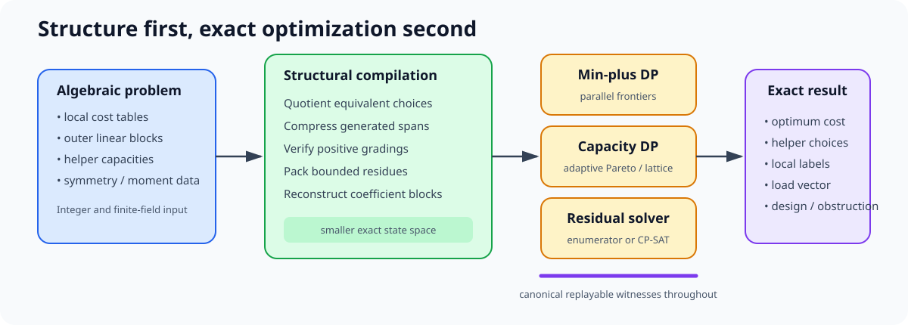
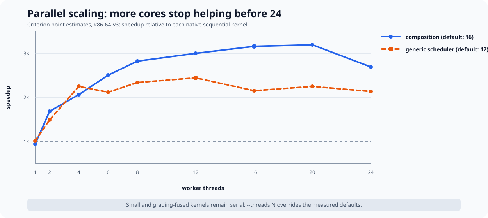
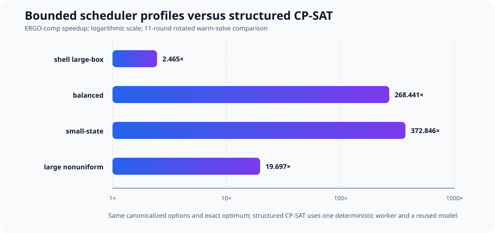

# ERGO-comp

**Exact Recovery and Generalized-weight Optimization Compiler**

The Exact Recovery and Generalized-weight Optimization Compiler (ERGO-comp) is
an exact compiler and solver for structured linear-code recovery, capacitated
repair scheduling, and orbit-structured code search. It turns quotients,
conserved gradings, generated-span state, bounded moment alphabets, and
reconstructible coefficient blocks into smaller exact state spaces, then
solves them with specialized engines or passes a reduced residual model to
constraint programming-satisfiability (CP-SAT).

It computes hierarchical cost tables, helper and confinement thresholds,
maximum feasible repair batches, and structured code-search optima. Each result
retains the helper choices, intermediate labels, resource loads, coefficient
data, or obstruction needed to replay it.

The paper proves the reductions that ERGO-comp uses. No theorem in the paper
depends on this implementation or on its benchmark results.

The implemented core already serves three domains: exact recovery and
confinement, capacity-aware batch scheduling, and orbit-structured code search.
The same exact objects give immediate front ends for batch and private
information retrieval (PIR), availability analysis, topology-aware repair,
service-rate optimization, code design by full recovery profile, and
experiments beyond generalized weights. Reliability
polynomials, secret-sharing and represented-matroid interfaces, and broader
algebraic preprocessing for generic solvers are research directions, not
claims about the current command-line interface.

As secondary implementation evidence, ERGO-comp is 2.5--373 times faster than
CP-SAT receiving the same safe preprocessing on the recorded exact scheduler
profiles. The bounded comparison and its controls appear below; the tool's
scientific role is its exact algebraic compilation and replay semantics.

## What it does

- **Hierarchical recovery compilation.** Compose labelled prescribed-coset
  costs through concatenated codes by exact min-plus substitution, retaining a
  local witness at every layer.
- **Exact confinement thresholds.** Compute generator- and syndrome-side
  thresholds with the target and recoverable sector kept explicit.
- **Capacitated batch repair.** Select the maximum simultaneously repairable
  demand set under helper, rack, link, or service capacities and return the
  complete assignment and load vector.
- **Generated-span reuse.** Compile duplicate, zero, and proportional columns
  once, then answer repeated recovery queries from the resulting span table.
- **Structured code search.** Compile orbit choices, modular syndromes,
  incidence constraints, and reconstructible coefficient blocks before a
  residual exact search.
- **Auditable exactness.** Use integer and finite-field arithmetic throughout,
  with deterministic tie-breaking, Python differential oracles, and replayable
  witnesses.



ERGO-comp is not a universal replacement for CP-SAT. It is designed for exact
problems whose algebraic structure is expensive for a generic Boolean model to
rediscover. It can solve the compiled problem directly or act as a front end
that gives CP-SAT a smaller, stronger residual model.

## Sixty-second examples

The Rust package provides the `ergo-comp` command. It reads JSON and writes a
deterministic JSON result.

```sh
cd rust
cargo run --release --bin ergo-comp -- \
  schedule --input examples/data/schedule.json
```

The example has two repair demands, two unit-capacity resources, and two legal
helper-load choices per demand. ERGO-comp returns a complete assignment:

```json
{
  "repaired_count": 2,
  "complete": true,
  "assignment": [
    {"demand": 0, "loads": [0, 1]},
    {"demand": 1, "loads": [1, 0]}
  ],
  "unmatched_demands": [],
  "total_loads": [1, 1],
  "backend": "dense-lattice",
  "transitions_examined": 8,
  "peak_pareto_states": 4
}
```

Hierarchical composition uses the same interface:

```sh
cargo run --release --bin ergo-comp -- \
  compose --input examples/data/compose.json
```

The output reports the exact cost, the compiled state and transition counts,
and the local label chosen in each outer block:

```json
{
  "feasible": true,
  "cost": 2,
  "local_labels": [{"rows": 1, "cols": 1, "data": [1]}],
  "compiled_labels": 2,
  "transitions_examined": 2
}
```

Matrix data is row-major and reduced in the declared field. The composition
command dispatches prime fields of orders 2, 3, 5, 7, 11, and 13, and the
canonical polynomial-basis representation
`GF(4) = GF(2)[a]/(a^2+a+1)`. Extension-field elements `0,1,2,3` encode
`0,1,a,a+1`; the JSON field descriptor declares degree two and modulus
`[1,1,1]`. The library API can instantiate other prime orders at compile time.

```sh
cargo run --release --bin ergo-comp -- \
  compose --input examples/data/compose-gf4.json
```

The paper's functional-label separation is executable directly from its two
represented binary encoders and fixed outer functional dual:

```sh
cargo run --release --bin ergo-comp -- \
  transfer --input examples/data/f4-scalar-separation.json
```

The result derives the associated pair `K_P` inside `D_P`, its quotient
dimension and rank-one relative weight, both ordinary and target-normalized
labelled cost tables, and the common inner-dual distance. It then computes the
zero and nonzero sectors and `Gamma`, identifies the selected outer label, and
expands the winning labels to binary coefficient witnesses. Candidate and
outer-functional counts are reported separately from timing.

An explicit normalized target subspace uses the matrix-valued path:

```sh
cargo run --release --bin ergo-comp -- \
  transfer-subspace --input examples/data/transfer-subspace.json
```

This compiles union support across all demand columns, retains matrix-valued
labels and coefficient witnesses, and evaluates the arbitrary-rank functional
dual formula. A represented tower can then be compiled and replayed end to end:

```sh
cargo run --release --bin ergo-comp --features parallel -- \
  transfer-tower --input examples/data/transfer-tower.json --parallel
```

The output is a budgeted recursive witness tree: internal nodes record the
minimizing intermediate labels and leaf nodes expand them to coefficient
matrices for the original inner encoder. Sequential and parallel execution
return the same canonical tree. The theorem-native front ends currently remain
bounded to binary encoders represented in canonical GF(4); other extension
fields remain staged extensions.

Large composition frontiers and generic scheduler Pareto/lattice kernels can
run in parallel without changing the exact result or canonical witness:

```sh
cargo run --release --features parallel --bin ergo-comp -- \
  compose --parallel --input examples/data/compose.json

cargo run --release --features parallel --bin ergo-comp -- \
  schedule --parallel --threads 12 --input examples/data/schedule.json
```

`--parallel` uses measured command-specific caps: at most 16 workers for
composition and 12 for scheduling. `--threads N` makes the worker count
explicit. Small or already-fused kernels stay serial when dispatch overhead
would exceed the available parallel work.



| profile           |     1 |     2 |     4 |     6 |     8 |    12 |    16 |    20 |    24 |
|:------------------|------:|------:|------:|------:|------:|------:|------:|------:|------:|
| composition       | 0.94x | 1.68x | 2.06x | 2.50x | 2.82x | 3.00x | 3.15x | 3.19x | 2.69x |
| generic scheduler | 1.01x | 1.49x | 2.24x | 2.11x | 2.34x | 2.44x | 2.15x | 2.24x | 2.13x |

These Criterion point estimates compare each parallel path with its native
sequential kernel. They explain the conservative defaults: using all 24 cores
is slower on both measured workloads.

## Why compilation matters

A generic solver sees variables and constraints. ERGO-comp also sees the
mathematical reason many of those variables are equivalent or impossible.

For equal-mass concurrent repair, a positive grading proves that distinct
states at a fixed repair count cannot dominate one another. The scheduler can
therefore use an exact graded shell instead of maintaining a generic Pareto
frontier over the entire capacity box.

For repeated inner-code queries, the prescribed-coset cost depends only on a
generated image subspace. A single compiled span catalogue serves every label,
outer code, and later tower level. In the included cyclic binary family, the
catalogue remains at five generated spans while direct lift enumeration grows
through `2^128` candidates.

For orbit-structured code construction, ERGO-comp quotients symmetry, packs
additive syndrome contributions, applies bounded moment and incidence gates,
and reconstructs coefficient blocks from small seed data. Only the residual
spatial constraints reach the final enumerator.

## Bounded comparison with CP-SAT

The benchmark suite contains both a raw Boolean CP-SAT model and a structured
CP-SAT control. The structured control receives the same feasibility filtering,
duplicate removal, Pareto canonicalization, positive-grading bound,
single-worker policy, and model reuse available without using ERGO-comp's
specialized dynamic program. All solvers must agree on the optimum and retained
loads before timing is accepted.

An interleaved 11-round comparison on the frozen scheduler profiles measured:

| profile          | ERGO-comp | raw CP-SAT | structured CP-SAT | vs. raw  | vs. structured |
|:-----------------|----------:|-----------:|------------------:|---------:|---------------:|
| shell large-box  | 71.881 us | 178.630 us |        177.221 us |   2.485x |         2.465x |
| balanced         |  3.710 us |   1.143 ms |        995.895 us | 308.036x |       268.441x |
| small-state      |  7.304 us |   2.753 ms |          2.723 ms | 376.977x |       372.846x |
| large nonuniform | 52.849 us |   1.250 ms |          1.041 ms |  23.646x |        19.697x |



These are bounded results for the declared profiles, not a general solver
ranking. The exact machine, toolchain, inputs, repetitions, samples, checksums,
and peak-memory observations live in `rust/evidence/benchmarks.json`. The
rotated harness keeps model construction and reuse policies explicit.

Component benchmarks are reported separately from these end-to-end solver
comparisons. Nanosecond kernel timings do not constitute CP-SAT speedups.

## Architecture

The Rust engine is organized around compact, contiguous state:

- range-sized integer identifiers into arena-backed witness pools;
- row-major matrices and packed ternary syndromes;
- generated-span and min-plus tables with deterministic canonicalization;
- adaptive sparse-Pareto, dense-lattice, and graded-shell scheduling;
- transactional rollback elimination for incremental finite-field constraints;
- optional Rayon parallelism outside the narrow sequential kernels; and
- portable safe Rust in the core engine, with no raw-pointer hot-path design.

The Python package in `recovery_algorithms/` is the independent exact oracle.
It favors transparent enumeration and algebra over throughput. Rust fixtures
are generated from the Python implementation, then checked for costs,
witnesses, and helper loads.

## Validation

From `rust/`:

```sh
cargo fmt --check
cargo clippy --all-targets --all-features -- -D warnings
cargo test --all-features
```

From this directory:

```sh
python3 -m unittest -v test_algorithms.py
python3 generate_evidence.py --check
```

Release measurements use an explicit target flag rather than a repository-wide
Cargo override. The current reproducible x86-64 baseline is built with:

```sh
RUSTFLAGS="-C target-cpu=x86-64-v3" \
  cargo build --release --manifest-path rust/Cargo.toml --bin bench_kernels
```

Portable builds use Cargo's default target. A native or AVX-512-enabled build
is not assumed to be faster; it must win the same interleaved workload before
being reported.

## Evidence and trust boundary

`generate_evidence.py` produces canonical JSON and `SHA256SUMS`, and its
`--check` mode regenerates the claims without changing the tree. The evidence
records exact bounded computations and benchmark observations. It does not turn
a finite search into an unrestricted theorem or make program execution part of
the proof of a manuscript theorem.

The mathematical definitions, correctness statements, and complexity bounds
are given in *Exact Compositional Transfer of Bounded Linear Recovery: Relative
Weights and Labelled Coset Costs*. They
establish the reductions independently of the software. The
implementation carries those reductions to problem sizes and applications that
direct enumeration or generic Boolean modeling reaches less effectively.

## License

ERGO-comp is released under the MIT License as part of the paper's companion
repository.
