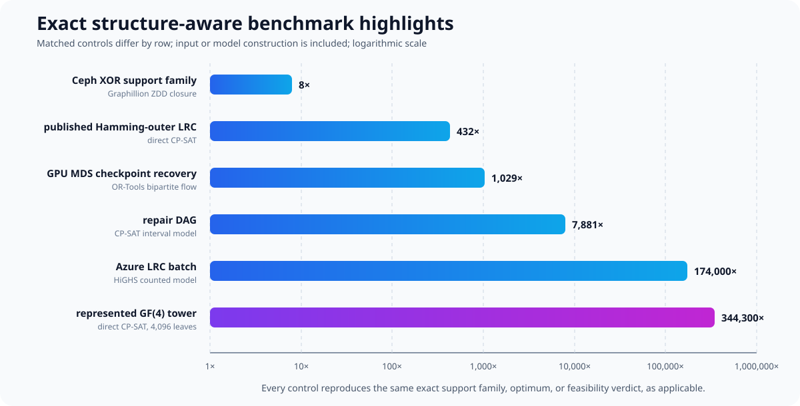
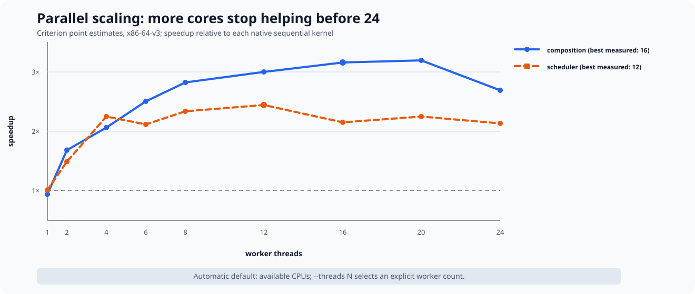

# ergodis benchmarks

This document records bounded performance evidence, replay commands, and
backend-specific measurement notes. See `README.md` for installation and use.

## Application-example comparisons

These benchmarks ask six concrete questions about storage and coding systems.
Each example preserves the structure of its source problem rather than first
flattening it into generic Boolean variables.

### What the scenarios mean

**Distributed XOR repair (Ceph-style).** Ceph is a distributed object-storage
system. This synthetic Ceph-style case models an object protected by several
layers of XOR parity. Each layer offers alternative helper paths, so the number
of minimal repair sets doubles repeatedly. The benchmark constructs the
complete family of minimal surviving helper sets and keeps it available for
reliability and scheduling queries. A zero-suppressed decision diagram (ZDD)
stores this set family by sharing repeated choices instead of listing every set.

**Cloud repair batching (Azure-style).** A locally repairable code (LRC) is
designed so that a missing fragment can usually be rebuilt from a small nearby
group instead of reading the whole codeword. The benchmark uses a published
layout for Microsoft's Azure code. Many data fragments fail while nine storage
or upgrade domains have separate capacity limits. Each fragment can be
repaired locally or through either of two global parities, and those choices
load the domains differently. The benchmark chooses the repair mode for every
request to maximize the number served; the large instance contains 100,000
requests but only six distinct load types.

**Repair dependency graph.** A directed acyclic graph (DAG) records which repair
tasks must finish before other tasks can start. Several ready tasks may run
together if their combined resource loads fit within the slot capacities. The
benchmark finds the shortest valid schedule and returns the tasks assigned to
each slot.

**Sparse graph-code failure search.** A low-density parity-check (LDPC) code is
an error-correcting code defined by a sparse graph. In a quasi-cyclic (QC) LDPC
code, a large graph is assembled by cyclically shifting a small template.
Certain small groups of variables can trap an iterative decoder or prevent it
from making progress. The benchmark asks whether such a group of a prescribed
size exists and returns it when it does. The repeated cyclic structure and the
graph components replace a search over all subsets of the large code.

**Vector repair.** One physical storage node may hold several subpacketized
symbols, but reading any number of its symbols incurs one node cost. The
benchmark finds the fewest physical nodes whose combined linear span contains
the requested target subspace and returns those nodes.

**GPU checkpoint recovery.** A maximum-distance-separable (MDS) code lets any
sufficiently large set of surviving checkpoint shards reconstruct a failure.
The shards are spread across GPU nodes and racks, and a failed batch must be
rebuilt without exceeding per-node and same-rack or cross-rack transfer
capacities. The benchmark decides aggregate feasibility first and then emits
every concrete helper-shard assignment. It models repair traffic after
placement is fixed, not GPU execution or overlap with training.

### Headline results

The rows below are bounded demonstrations of these six application models, not
a claim that the subcommand is a complete storage or coding suite. Every
control reproduces the same exact support family, optimum, or feasibility
verdict, as applicable.

Read the chart as six separate matched comparisons, not as a ranking of the
applications or controls. The Ceph row asks for an entire support family and
therefore compares two compressed family representations. The other rows ask
for an optimum or an exact feasibility decision. Every multiplier is the
control time divided by the ergodis time: `1,000x` means that the control took
1,000 times as long to return the same exact result. The largest gains occur
when the algebra reduces a large raw model to a few load types, graph
components, or aggregate capacity totals before the exact solve begins.



| application      | bounded instance                  | matched exact control          | ergodis time | control time | result           |
| :--------------- | :-------------------------------- | :----------------------------- | -----------: | -----------: | :--------------- |
| Ceph XOR         | 8 diamonds, 256 minimal supports  | Graphillion ZDD family closure |       102 us |       864 us | ergodis 8x       |
| Azure LRC        | 100,000 demands, domain cap 100k  | HiGHS counted integer model    |        <1 us |     4,877 us | ergodis 173,996x |
| Repair DAG       | 3 layers x 21 tasks               | CP-SAT interval scheduling     |         2 us |    19,218 us | ergodis 7,881x   |
| QC-LDPC          | lift 50,000, weight 4             | CryptoMiniSat native XOR       |     1,517 us |   509,306 us | ergodis 336x     |
| vector node span | 64 nodes, 2 symbols per node      | CryptoMiniSat native XOR       |        10 us |    48,691 us | ergodis 4,717x   |
| GPU MDS          | 10,000 shards, k=6,000, 64 failed | OR-Tools bipartite max-flow    |       100 us |   103,061 us | ergodis 1,029x   |

| application      | ergodis RSS | control RSS |
| :--------------- | ----------: | ----------: |
| Ceph XOR         |     2.2 MiB |    19.4 MiB |
| Azure LRC        |     2.2 MiB |    61.6 MiB |
| Repair DAG       |     2.3 MiB |    79.1 MiB |
| QC-LDPC          |     4.0 MiB |   231.8 MiB |
| vector node span |     2.2 MiB |    20.8 MiB |
| GPU MDS          |     3.6 MiB |    69.1 MiB |

### Methodology

Each row uses a formulation-specific open-source control that matches the
question being answered. Times include construction of the ergodis state or
the control model; RSS is the process high-water memory. The two programs were
run with the same CPU affinity in rotated order so ambient machine load did not
systematically favor either one. The headline controls use eleven rounds, and
the table reports medians and ratios computed from the unrounded samples.

The controls establish exact equality of the support family, optimum, or
feasibility verdict rather than agreement on a heuristic score. Raw samples,
checksums, package versions, and replay commands are recorded in
`evidence/benchmarks.json`. Commercial solvers and domain-specific LDPC
enumerators are not included, so these measurements support only the declared
instance comparisons.

The outcome strength is not identical across rows. Each control returns the
same support family, optimum, or feasibility verdict, as applicable; ergodis
often returns a richer application-level object:

| application      | exact control establishes        | additional ergodis output                                      |
| :--------------- | :------------------------------- | :------------------------------------------------------------- |
| Ceph XOR         | compact exact 256-support family | packed exact ZDD, canonical support, and closure-work counters |
| Azure LRC        | maximum repaired count           | mode counts, all nine loads, direct capacity check             |
| Repair DAG       | optimal makespan and schedule    | canonical task batches and ready-state count                   |
| QC-LDPC          | no weight-four codeword          | component reason; normalized witness when feasible             |
| vector node span | optimum is four nodes            | canonical helpers, span count, transition count                |
| GPU MDS          | feasible full helper flow        | every helper shard, node/rack loads, cyclic witness            |

The compressed Ceph kernel removes the earlier explicit-antichain bottleneck.
It retains the exponentially branching family as a packed ZDD, then reuses that
state for exact reliability and resource-aware scheduling without materializing
the supports.  The Graphillion samples above are unchanged; only the affected
Rust measurements were rerun.

| diamonds | represented supports | compressed family | exact reliability | scheduling quotient |
| -------: | -------------------: | ----------------: | ----------------: | ------------------: |
|       10 |                1,024 |             89 us |            100 us |              102 us |
|       30 |        1,073,741,824 |          1,002 us |          1,083 us |            1,101 us |
|       80 |       2^80 = 1.21e24 |  not materialized |          6,722 us |            7,727 us |

At ten diamonds, the previous explicit Rust path takes 728,737 us and 10.2 MiB
to materialize 1,024 supports.  The reliability column instead returns exact
success counts by available-helper cardinality.  The scheduling column compiles
the family to a Pareto-minimal two-domain load frontier, solves two demands,
and retains a representative helper support for each selected load vector.

The large wins come from mathematical reductions: six demand types for Azure
LRC, full-ready-set dominance for unit repair DAGs, connected components for
degree-two QC parity checks, quotienting identical generated node subspaces,
and aggregate MDS capacity followed by cyclic witness realization. The GPU
row is particularly diagnostic: max-flow is the natural general exact model,
but the symmetric placement theorem removes its complete
failure-by-survivor graph while still emitting all 384,000 assignments.

Direct CP-SAT remains as a common stress control rather than the headline
comparison:

| application / control            | bounded instance                  | ergodis time | CP-SAT time | outcome              |
| :------------------------------- | :-------------------------------- | -----------: | ----------: | :------------------- |
| Azure LRC / direct CP-SAT        | 100,000 demands, domain cap 100k  |        <1 us |      8.95 s | ergodis 319,347,596x |
| Azure LRC / counted CP-SAT       | same six-type quotient            |        <1 us |    1,732 us | ergodis 61,799x      |
| Repair DAG / direct CP-SAT       | 3 layers x 21 tasks               |         2 us |      1.20 s | ergodis 494,061x     |
| QC-LDPC / direct CP-SAT          | lift 50,000, weight 4             |     1,517 us |      1.52 s | ergodis 1,001x       |
| vector node span / direct CP-SAT | 64 nodes, 2 symbols per node      |        10 us |      1.21 s | ergodis 117,097x     |
| GPU MDS / direct CP-SAT          | 10,000 shards, k=6,000, 64 failed |       100 us |     11.82 s | ergodis 118,014x     |

| application / control     | ergodis RSS | CP-SAT RSS |
| :------------------------ | ----------: | ---------: |
| Azure LRC / direct        |     2.2 MiB |  916.6 MiB |
| Azure LRC / counted       |     2.2 MiB |   75.5 MiB |
| Repair DAG / direct       |     2.3 MiB |  145.5 MiB |
| QC-LDPC / direct          |     4.0 MiB |  381.6 MiB |
| vector node span / direct |     2.2 MiB |   85.9 MiB |
| GPU MDS / direct          |     3.6 MiB |    1.9 GiB |

When all replacements share a rack and every survivor is remote from the
replacement nodes, the GPU compiler first aggregates feasible reads by helper
node and rack tier, then realizes the resulting shard degrees cyclically. This
avoids both the exponential helper-family enumeration and the complete
failure-by-shard flow graph while still returning all 384,000 helper
assignments. Other placements retain the general exact scheduler. The direct
Azure and GPU rows each use one completed CP-SAT proof; their solves take
seconds and peak near 1 and 2 GiB respectively. The counted Azure control and
the other CP-SAT rows use seven rounds, as do all Rust rows. These are
formulation-specific results, not a universal solver ranking. The matched
controls use eleven rounds. Counted CP-SAT is 5,168x faster than direct CP-SAT
on the Azure instance, but ergodis is faster than both. Raw samples, RSS,
checksums, artifact hashes, and
exact package versions are stored in `evidence/benchmarks.json`; replay with:

```text
python/run_benchmarks.py --write --applications-only --ab-rounds 7
python/run_benchmarks.py --write --application-sota-only --ab-rounds 11
nix shell nixpkgs#uv --command uv run --no-project \
  --with pycryptosat==5.14.7 --with graphillion==2.1 \
  python3 python/verify_baseline_encodings.py
```

## Contextual-state A/B

The contextual-state shortcuts were measured in two interleaved rounds with the
A/B order reversed, 15 Criterion samples per round, a one-second warmup, and a
half-second measurement window.  Times below are the means of the two reported
central estimates.  Inputs are deterministic microcases; they establish the
cost of these kernels, not an end-to-end application speedup.

| operation                                  |  baseline | optimized | result |
| :----------------------------------------- | --------: | --------: | -----: |
| rank-one radius decision                   |  33.55 us |  26.98 us |  1.24x |
| complete-transfer check through ranks 1--4 | 194.34 us |  0.300 us |   648x |
| projective line cache, first query         |  15.45 us |  14.36 us |  1.08x |
| projective line cache, warm query          |  14.75 us |  7.226 us |  2.04x |
| projective auto, one forecast query        |  14.95 us |  14.94 us |  1.00x |
| rank-bounded context cache, first query    |  13.90 us |  20.42 us |  0.68x |
| rank-bounded context cache, warm query     |  13.63 us |  2.342 us |  5.82x |
| rank-bounded auto, one forecast query      |  13.85 us |  13.85 us |  1.00x |

The radius certificate examines the same 255 outer vectors in the successful
case but performs only 256 local lookups after radius pruning.  The all-rank
shortcut replaces 4,676 generator candidates by seven rank-one candidates and
12 local lookups.  The projective case stores 85 line probes; its cold pass
performs the same 255 scalar probes as direct enumeration and now pays off on
the first query.  The rank-bounded atomic fill stores 50 subspace responses but
visits each of the 255 nonzero maps exactly once, rather than repeating 570
subproblem candidates; cold plus one warm query beats two direct queries, so
its threshold is two.  `Auto` bypasses that cold fill for a one-query forecast
with no resolved timing penalty (13.85 versus 13.85 us) and leaves the cache
empty.  Peak RSS was 10.8--12.0 MiB in separate A/B processes; pairwise
differences were at most about 0.6 MiB and remain noisy at process level.

Replay wall time with `scripts/contextual-ab.sh`; replay peak RSS with
`scripts/contextual-memory-ab.sh` and the compiled Criterion binary.  The
canonical reduction of the measured logs is
`evidence/contextual-state-ab.json`; the reduction entry point is
`python/summarize_contextual_ab.py`.

### Application-specific applicability

The six headline storage kernels above do not call contextual confinement, so
injecting this cache into those rows would not test the optimization.  It does
apply directly to the Jin--Fu concatenated-LRC benchmarks, which repeatedly
evaluate compatible scalar-labelled GF(4) outer contexts.  Eleven
rounds were rotated across every variant.  The one-query rows include input
compilation; the eight-query rows retain state only for the warm variant.

| Jin--Fu workload                  | exact full result | radius certificate | cold cache | auto, one query | warm cache, 8-query mean |
| :-------------------------------- | ----------------: | -----------------: | ---------: | --------------: | -----------------------: |
| Ex. 5.7, cyclic `[43,36,5]`       |          13.87 ms |           11.55 ms |   2.288 ms |        2.245 ms |                 1.578 ms |
| Cor. 5.4, Hamming `[1365,1359,3]` |         104.30 ms |           75.67 ms |   7.052 ms |        6.996 ms |                 6.018 ms |

Cold caching is respectively 6.06x and 14.79x faster than exact enumeration;
eight-query warm reuse is 8.88x and 17.25x faster.  A zero-byte `Auto` budget
selects direct execution and measures 14.03 ms and 104.69 ms, indistinguishable
from the corresponding baselines.  The cache stores 5,461 and 1,365 projective
lines.  Peak RSS rises from about 2.6 to 2.7 MiB for Example 5.7 and from 2.6
to 4.3 MiB for the long-key Hamming case.  The planner therefore estimates
each entry from its actual key width plus record/index overhead, rather than a
fixed per-entry constant.

`context_cost` uses the one-query `Auto` forecast by default.  Callers use
`context_cost_cached` only to force admission or `context_cost_planned` when
they know a different reuse count or memory budget.  Thus default projective
queries select the measured cold win, while default one-shot rank-bounded
queries stay direct.  Once a context is complete in either cache, `Auto` reuses
it without treating already allocated records as a new admission.

These endpoints have different output strength.  The cache returns the exact
zero-truncated confinement value `gamma`; the certificate returns the exact
radius-four transfer decision.  Only the full baseline also retains the losing
nonzero minimum and its witness.  The comparison is valid for applications
asking for `gamma` or the transfer decision, not as a drop-in speed claim when
that additional losing-sector witness is required.  Raw samples and artifact
hashes are in `evidence/benchmarks.json` under `jin_fu_contextual_state_ab`;
replay with `python/run_benchmarks.py --write --jin-fu-contextual-only
--ab-rounds 11`.

## Bounded performance evidence

The GF(27) balanced Criterion target additionally measures two new compiled
stages.  On the current loaded host, two-fiber trace/product reconstruction
takes 33.212 ns, while a synthetic 32-binary-family, 102-coordinate affine
compilation takes 6.0292 us and guarantees at most 32 output coordinates.
The latter is a generic shape test, not the rank of the distinct GF(27)
102-parity balanced-carrier model.  The unrestricted carrier and mapping zero
in both semilinear representatives have now been checked separately and all
have full affine rank 102.  The local pair-difference rank is six at every
unmarked row; combined with the 17-row Vandermonde rank, this proves full rank
102 for every fixed mapping.  Their correct reduction is therefore two-fiber
carrier reconstruction rather than affine rebasing.  These are component
measurements, not a complete finite-branch solve.

The indexed nine-family seed join takes 215.11 us on a bounded 64-candidate-
per-family shape whose unique coherent seed pair is last, so all 4,096 seed
pairs are examined.  Genuine cubic/quartic candidate generation is excluded
from this component timing.

From-scratch elimination of 18 high-cell equations and reconstruction of the
unique carrier takes 5.5344 us.  The recursive search should use transactional
rollback updates rather than rerun this cold baseline at every node.  The
implemented 384-byte aligned echelon state appends rows without modifying old
ones; rank-17 push/pop takes 323.54 ns, while adding the unique solve gives
523--552 ns across two Criterion sessions.

At a complete high-fiber ledger, double rows give common roots of every
carrier-kernel pair.  Eight double rows force carrier uniqueness; seven leave
at most one fractional-linear defect parameter.  The ledger keeps zero- and
double-row counts in its spare bytes and reports this zero/one nullity bound.

`python/run_benchmarks.py` runs fixed-affinity, rotated interleaved release comparisons
and records raw samples in `evidence/benchmarks.json`. On its one deterministic
workload per kernel, the seven-round medians are:

- weighted scheduling: 8.869 s Python versus 46.2 ms Rust flat, with identical
  35,334 transitions, a 1,907-state peak, and the same witness (`192x` here);
- ternary orbit search: 84.3 ms Python versus 1.064 ms Rust coordinatewise,
  with identical 16,645 visited states and the same infeasibility witness
  (`79x` here).

These are whole-solve, single-workload comparisons, not general speedups.
Python peak RSS was about 30 MiB; Rust was about 2.3--2.5 MiB, including
process overhead.

Two 11-round Rust-only A/B tests are instructive. Mixed-radix capacity keys
changed neither work nor frontier size and produced a paired median `1.005x`;
that is a wash, so the flat-load engine remains the default. Exact correlated
suffix residues reduced orbit DFS states from 16,645 to one, but took 4.28
times as long overall and raised peak RSS from 2.4 to 7.6 MiB because closure
construction dominated. It remains a bounded experimental backend for testing
an adaptive planner, not an accepted optimization.

The exact meet-in-the-middle orbit backend changes that conclusion on this
instance: its 26.1 us median is `40.4x` faster than coordinate DFS, `172.7x`
faster than correlated closure, and `3,229x` faster than Python. Its two half
enumerations examine 486 assignments and retain 243 right states. Bounded
preallocation contributes a separately measured `1.214x`.

A separate exact-feasibility scaling sweep holds four choices per family and
six ternary syndrome coordinates while increasing the number of orbit
families. CP-SAT receives one-hot family choices and the same exact ternary
syndrome equations. The packed coordinate engine is the appropriate ergodis
backend in this regime; building correlated suffix closure would waste both
time and memory.

| families | ergodis time | ergodis RSS | CP-SAT time | CP-SAT RSS | speedup |
| -------: | -----------: | ----------: | ----------: | ---------: | ------: |
|       80 |        50 us |     2.3 MiB |   30.024 ms |   77.4 MiB |    599x |
|      320 |       142 us |     2.4 MiB |  168.641 ms |   84.1 MiB |  1,184x |
|    1,280 |       647 us |     3.0 MiB |      1.11 s |  104.4 MiB |  1,712x |
|    8,192 |     2,792 us |     6.9 MiB |     20.32 s |  247.1 MiB |  7,279x |

The first two rows use 21 rotated rounds, the 1,280-family row seven, and the
seconds-scale 8,192-family row three. Every run returns the same feasibility
verdict; raw samples and artifact hashes are recorded separately from the
older Python-oracle comparison.
For unequal family sizes, the production split minimizes the exact sum of the
two contiguous half-assignment products, breaking ties toward the smaller
right table. On the skew `[2,2,2,2,2,2,64]` fixture this changes 520 examined
half assignments and 511 retained right states to 128 and 64, for a measured
`2.215x` improvement while preserving the first witness.

For scheduling, a mixed-radix dominance lattice replaces the quadratic Pareto
scan by a multidimensional prefix maximum. Direct addressing, guarded packed
capacity arithmetic, and once-dispatched `u64`/`u128` kernels remove hashing
and per-coordinate feasibility scans; each non-antichain frontier selects the
lattice transform only when its margin-adjusted `P H` estimate is no larger
than the quadratic `S^2 H` estimate.

A further exact certificate applies when every compiled option has the same
positive total load `m`: every frontier state has total load `m` times its
repair count, so two distinct states cannot dominate one another. Pareto
pruning is then skipped. In the narrow dense kernel, packed loads, the witness
ID, and the mixed-radix key form one 16-byte state. Coordinate loads are never
materialized, copied, or compacted. Equal-load incumbents cannot improve, so a
one-bit membership lattice replaces the `u32` incumbent table. Canonical final
witness selection uses an exact mixed-radix `u64` code when the certified
repair-depth bound fits; otherwise it compares persistent parent chains
iteratively with no allocation. The code, 24-bit parent, 8-bit depth, and
option ID occupy one 16-byte witness node. Compiled metadata selects sparse or dense generation once, with separate
occupancy models for this fused kernel and the general dominance kernels.

In the fresh 21-round fixed-affinity interleave, the balanced dense backend takes
144.0 us versus 1.170 ms for antichain-aware sparse Rust and 2.246 ms for a
reused-model OR-Tools 9.14 CP-SAT solve (`15.60x`). On the
small-state/high-demand case it takes 26.4 us versus 11.082 ms for CP-SAT
(`420.2x`). Relative to the immediately preceding certified implementation,
the fused state, bit membership, append-only loads, persistent index, and
allocation-free witness selection are representation changes; transition
counts and exact outputs are unchanged.

The seeded phase grid contains 26 profiles: thirteen `(H,c,D)` shapes at two
seeds, with equal four-option families, `P` from 81 through 1,048,576, and ten
solves per sample. The fused-kernel cost model selects correctly in all 26,
with maximum
measured dispatch regret `1.115x`. Rust beats reused-model single-worker CP-SAT
in all 26, with median `48.10x` and minimum `5.10x` speedup. This closes the two
previous large-lattice losses on the bounded grid, not universally.

A separate 11-round rotated comparison gives CP-SAT the same safe structural
preprocessing: capacity feasibility, option deduplication and Pareto
canonicalization, the exact positive-grading repair bound, one deterministic
worker, a reused model, and a reusable solver object.  On the new large-box
shell fixture Rust takes 73.4 us versus 185.3 us for this strengthened CP-SAT
control (`2.526x`); CP-SAT has zero branches and conflicts, so this is a
representation/dispatch comparison rather than a search-tree win.  The same
protocol gives Rust wins of `336.514x`, `560.936x`, and `18.074x` on the
balanced, small-state, and large-nonuniform profiles respectively.  These are
bounded warm-solve results, not universal claims about CP-SAT.

An end-to-end scaling sweep then increases one input axis at a time. The demand
sweep holds four options per demand; the option sweep holds 80 demands. Raw
CP-SAT receives all generated options, while the structured control receives
the same safe Pareto canonicalization and grading bound as ergodis. All
three backends return the same optimum.

| demands | ergodis time | ergodis RSS | raw CP-SAT |   raw RSS | structured CP-SAT | structured RSS | speedup: raw / structured |
| ------: | -----------: | ----------: | ---------: | --------: | ----------------: | -------------: | ------------------------: |
|      80 |        49 us |     2.3 MiB |   6.693 ms |  74.9 MiB |          6.768 ms |       74.7 MiB |               135x / 137x |
|     320 |       109 us |     2.4 MiB |  27.803 ms |  78.2 MiB |         27.695 ms |       77.7 MiB |               255x / 254x |
|   1,280 |       377 us |     2.7 MiB | 210.064 ms |  97.2 MiB |        208.984 ms |       95.5 MiB |               557x / 555x |
|   8,192 |     2,205 us |     4.8 MiB |     1.37 s | 199.9 MiB |            1.34 s |      188.1 MiB |               622x / 607x |

| options per demand | ergodis time | ergodis RSS | raw CP-SAT |   raw RSS | structured CP-SAT | structured RSS | speedup: raw / structured |
| -----------------: | -----------: | ----------: | ---------: | --------: | ----------------: | -------------: | ------------------------: |
|                 64 |       351 us |     2.6 MiB |  71.672 ms |  84.9 MiB |         17.168 ms |       77.4 MiB |                204x / 49x |
|              1,024 |     3,964 us |     6.7 MiB |     1.58 s | 386.2 MiB |         70.355 ms |       89.8 MiB |                398x / 18x |

The small and medium rows use 21 rotated rounds; the two seconds-scale rows
use seven. This sweep shows two different advantages: the dense certified
kernel scales gently with demand count, while option canonicalization prevents
a thousand alternatives per demand from reaching the residual optimizer.

The represented-tower path has a separate 21-round, fixed-affinity end-to-end
comparison. Direct CP-SAT receives binary coefficient variables, the exact
row-support objective, and GF(4) parity constraints. The stronger-preprocessing
control receives the same independently generated labelled cost tables as
ergodis, then uses one-hot leaf choices and the same parity constraints.
Every solver proves the same optimum; ergodis additionally expands its
canonical coefficient witness tree.

| depth / fanout | leaves | ergodis time | direct CP-SAT | labelled CP-SAT | speedup: direct / labelled |
| :------------- | -----: | -----------: | ------------: | --------------: | -------------------------: |
| 2 / 2          |      4 |        94 us |      2.983 ms |        4.901 ms |                  32x / 52x |
| 3 / 3          |     27 |       175 us |     11.578 ms |       27.461 ms |                 66x / 156x |
| 4 / 3          |     81 |       177 us |     43.054 ms |      112.447 ms |                243x / 635x |
| 5 / 4          |  1,024 |       316 us |        8.17 s |          1.58 s |           25,889x / 5,013x |
| 6 / 4          |  4,096 |       766 us |      263.76 s |          6.19 s |          344,300x / 8,080x |

| depth / fanout | ergodis RSS | direct RSS | labelled RSS |
| :------------- | ----------: | ---------: | -----------: |
| 2 / 2          |     2.3 MiB |   74.6 MiB |     75.2 MiB |
| 3 / 3          |     2.3 MiB |   75.8 MiB |     77.3 MiB |
| 4 / 3          |     2.4 MiB |   78.8 MiB |     82.3 MiB |
| 5 / 4          |     2.4 MiB |  126.5 MiB |    158.1 MiB |
| 6 / 4          |     2.8 MiB |  281.4 MiB |    411.4 MiB |

These are bounded single-worker results for the identity-block GF(4) tower
family, not a general claim about CP-SAT. The first three rows use 21 rounds;
the 1,024-leaf row uses seven. At 4,096 leaves, Rust uses 21 samples, labelled
CP-SAT seven, and direct CP-SAT one completed solve. Raw samples, artifact
hashes, work counters, and the exact protocol are in
`evidence/benchmarks.json`; replay the first four rows with
`python/run_benchmarks.py --write --transfer-only --ab-rounds 21` and the last with
`python/run_benchmarks.py --write --transfer-deep-only` after building the release
benchmark binary with the documented architecture flags.

A benchmark taken directly from the paper uses Jin and Fu's published GF(4) cyclic
`[43,36,5]` outer code and binary `[3,2,2]` inner code, which produce their
binary `[129,72,10;2]` locally repairable code
([Example 5.7](https://arxiv.org/abs/2605.04618)). The harness constructs the
outer dual basis independently from the stated generator polynomial and
optimizes over all `4^7 - 1 = 16,383` nonzero outer functionals. ergodis
computes `M_1=2`, zero-functional cost `5`, best nonzero-functional cost `26`,
and hence `Gamma=5`, so the maximum confined radius is `4`. These recovery
quantities are new analysis of the published code, not claims made by Jin and
Fu.

| backend         | exact time | peak RSS | relative time |
| :-------------- | ---------: | -------: | ------------: |
| ergodis         |  20.938 ms |  2.2 MiB |            1x |
| direct CP-SAT   |     4.07 s | 78.5 MiB |          195x |
| labelled CP-SAT |     4.91 s | 79.2 MiB |          235x |

Direct CP-SAT receives binary inner coefficients, the support objective, and
the exact GF(4) outer-functional parity constraints. Labelled CP-SAT receives
the same four-entry ordinary and target-normalized cost tables as ergodis.
Both CP-SAT models prove the nonzero-sector optimum before it is compared with
the known zero sector; all three backends return the same exact `Gamma`.
Times are medians of seven rotated, fixed-affinity, deterministic single-worker
runs. Replay with `python/run_benchmarks.py --write --jin-fu-only --ab-rounds 7`.

A larger member of Jin and Fu's published Hamming-outer family makes the same
comparison at storage scale. Corollary 5.4 with extension degree six gives a
GF(4) Hamming `[1365,1359,3]` outer code and binary
`[4095,2718,6;2]` perfect LRC. The harness generates the complete projective
simplex dual, verifies its constant-weight property independently, and checks
all `4^6 - 1 = 4,095` nonzero outer functionals. All three backends prove the
same exact result: `M_1=2`, zero-functional cost `5`, best nonzero-functional
cost `1,023`, `Gamma=5`, and maximum confined radius `4`.

| backend         | exact time | peak RSS | relative time |
| :-------------- | ---------: | -------: | ------------: |
| ergodis         |     231 ms |  2.4 MiB |            1x |
| direct CP-SAT   |      100 s |  119 MiB |          432x |
| labelled CP-SAT |       82 s |  124 MiB |          356x |

The Rust time is the median of 21 fixed-affinity runs. Because each exact CP-SAT
solve takes more than a minute, its row is one completed deterministic
single-worker proof of optimality, not a timing distribution. This is a mixed
algorithm-and-engineering comparison: unlike the represented-tower results
above, it does not isolate min--sum composition as the sole source of the win.
Replay with `python/run_benchmarks.py --write --jin-fu-hamming-only`.

ergodis alone can be pushed much farther before ten seconds. The following
use fixed CPU affinity and are single end-to-end solves, including instance compilation and
complete witness construction. They are the largest completed geometric or
power-of-ten probes attempted, not claimed hard limits.

| kernel                     | input scale                                  |            exact work |   time |  peak RSS |
| :------------------------- | :------------------------------------------- | --------------------: | -----: | --------: |
| represented tower          | depth 14, fanout 4; 268,435,456 leaves       | 357,913,941 witnesses | 3.90 s |   2.5 MiB |
| scheduling: demand scaling | 40,000,000 demands; 4 alternatives each      |   2,039,999,880 moves | 8.03 s | 2,787 MiB |
| scheduling: fanout scaling | 80 demands; 14,000,000 alternatives each     |           9,338 moves | 9.12 s |   2.3 MiB |
| orbit feasibility          | 10,000,000 families; 4 alternatives, width 6 |     10,000,003 states | 3.08 s | 4,523 MiB |

The tower streams nearly 358 million reconstructible witness records. The
scheduler-fanout row generates and canonicalizes 1.12 billion alternatives,
yet retains only the antichain needed for 9,338 optimizer moves. The demand
and orbit axes remain representation-memory limited; tower replay and
scheduler fanout no longer are. Replay with
`python/run_benchmarks.py --write --ergodis-limits-only`.

Zen 5 top-down microarchitecture analysis supports that diagnosis. These are
percentages of pipeline slots, rounded to whole percentages; the top-level
group is multiplexed and therefore approximate. The memory/core columns come
from a separate nonmultiplexed backend-breakdown run.

| kernel                     | retiring | frontend | bad speculation | backend | memory | core |
| :------------------------- | -------: | -------: | --------------: | ------: | -----: | ---: |
| represented tower          |      55% |       2% |              1% |     42% |    21% |  20% |
| scheduling: demand scaling |      38% |      32% |             17% |     13% |     6% |   3% |
| scheduling: fanout scaling |      18% |      17% |             25% |     39% |    30% |   9% |
| orbit feasibility          |      61% |      14% |              1% |     24% |    22% |   2% |

These measurements follow streaming witness/input introduction and precede
the final narrow-load representation. They show the tower shifting from 48%
memory-bound to a balanced 21% memory / 20% core split, while the streamed
fanout compiler exposes branch and residual memory costs. Replay with
`python/run_benchmarks.py --write --tma-large-only`.

Tower witness replay therefore also has a low-memory mode. It retains the
compiled argmin tables, preallocates one `O(depth * fanout)` choice scratch,
and emits preorder records through a callback; it allocates neither per node
nor per push. A record contains its level, label bytes, cost, normalization
flag, and child count, so the original tree is reconstructible from the
stream. The eager API remains available when callers actually need an owned
tree.

| mode      | depth / fanout | witness records |   time |  peak RSS |
| :-------- | :------------- | --------------: | -----: | --------: |
| eager     | 12 / 4         |      22,369,621 | 1.32 s | 1,965 MiB |
| streaming | 12 / 4         |      22,369,621 | 238 ms |   2.4 MiB |
| streaming | 14 / 4         |     357,913,941 | 3.83 s |   2.4 MiB |

At depth 12, streaming is 6x faster and uses about 800x less peak memory. The
depth-14 run expands 268 million leaves and nearly 358 million exact witness
records below four seconds. These are seven-round rotated medians at depth 12
and three rounds at depth 14; replay with
`python/run_benchmarks.py --write --tower-stream-only --ab-rounds 7`.

Scheduling input compilation has a matching streaming path. Its generic
iterator API maintains each family's Pareto-minimal antichain online; generated
callers can yield stack arrays, and materialized callers use the same canonical
implementation. Family records occupy 8 bytes, option offsets are derived
from fixed-width layout rather than stored, and retained loads use the
narrowest exact `u8`/`u16`/`u32` representation selected once at construction.

| axis                   | materialized time | materialized RSS | streamed time | streamed RSS |
| :--------------------- | ----------------: | ---------------: | ------------: | -----------: |
| 10,000,000 demands x 4 |            2.81 s |        3,588 MiB |        2.31 s |    1,576 MiB |
| 80 demands x 1,000,000 |            2.69 s |        4,275 MiB |        891 ms |      2.2 MiB |

These three-round rotated comparisons use identical generated alternatives,
work counts, and optima. The final derived-offset and narrow-load changes then
move the 10-million-demand single run to about 2.14 s / 699 MiB and enable the
40-million-demand stress row above. Replay the paired comparison with
`python/run_benchmarks.py --write --streaming-input-only`.

The frontier-sized thread sweep includes compilation and uses CPUs 0--23 for
parallel variants. Additional workers act only on the small residual solve,
so the results are effectively flat; 24 is not the optimum.

| axis                    |      single thread |           best parallel | verdict |
| :---------------------- | -----------------: | ----------------------: | :------ |
| 40,000,000 demands x 4  | 8.25 s / 2,787 MiB | 8.13 s / 2,787 MiB (12) | neutral |
| 80 demands x 14,000,000 |   9.15 s / 2.4 MiB |    9.12 s / 2.6 MiB (8) | neutral |

Parentheses give worker count. These are single frontier probes, not stable
speedup claims; the sequential path remains the default for these shapes.
Streaming tower replay and the deep orbit DFS are currently sequential, so no
synthetic multithread number is reported for those rows.
Replay with `python/run_benchmarks.py --write --ergodis-thread-sweep-only`.

A fixed-affinity `perf stat` diagnostic on the largest nonuniform profile records
about 661,000 cycles, 2.01 million instructions, 341,000 branches, 454 branch
misses, and 961 cache misses per solve. Against the preceding implementation,
instructions per examined transition fall from about 357 to 61. Top-down slot
analysis attributes about 16.0% to memory-bound backend stalls, 0.7% to
core-bound backend stalls, 10.4% to frontend stalls, 0.1% to bad speculation,
and 33.4% to retiring; multiplexed counters make these approximate. The change
is state representation and allocation removal, not reduced transition counts.

Repeated callers can pass a `WeightedRepairWorkspace` to
`solve_adaptive_with_workspace`, `solve_adaptive_parallel_with_workspace`, or
`solve_dense_lattice_with_workspace`.
Frontiers, witnesses, membership bits, and narrow packed metadata then retain
their allocations between exact solves; result ownership remains unchanged.
The workspace is problem-independent and offers `shrink_to_fit` when a caller
wants to release retained capacity. In a fresh 21-round fixed-affinity interleave,
workspace reuse improves the large nonuniform profile from 205.0 to 133.3 us
(`1.538x`), the balanced profile from 9.48 to 7.72 us (`1.227x`), and the
tiny-state/high-demand profile from 12.20 to 11.07 us (`1.102x`). Work,
frontier peaks, checksums, and median process peak RSS agree. Sampling reduces
`memmove` from 3.7% to 0.9% and `realloc` below the reported threshold.

The next L1D pass uses the dense ceiling twice. Mixed-radix keys occupy at most
24 bits, so the high byte of the state's key word stores repair depth. Witness
nodes then need only `(parent: u32, option: u32)`, an asserted 8-byte
`repr(C)` record rather than 16 bytes. Exact lexicographic codes are constructed
once in a sequential scratch pass after the dynamic program instead of being
read and extended inside every accepted transition. A 21-round saved-binary
interleave improves the large nonuniform workspace case from 161.1 to 134.8 us
(`1.195x`), the balanced graded case from 10.09 to 8.15 us (`1.237x`), and the
small-state case from 14.90 to 12.15 us (`1.226x`), with exact output/work
parity and neutral RSS. Instructions fall from about 62.5 to 51.5 per examined
transition and L1D misses by about 11% in the large diagnostic.

L1I is not presently limiting: hardware counters report roughly 0.1% fetch
misses and only a few dozen L1I misses per solve. Forcing the 7.7 KiB graded
kernel out of the 16.5 KiB dispatch symbol measured `1.018x`, `1.009x`, and
`0.999x`; it was reverted. Glibc's AVX-512/ERMS `memmove` is about 1.2% of
samples, so manual REP/copy code was likewise rejected.

Architecture flags are measured rather than inherited from the Queens engine.
On this Zen 5 host, `target-cpu=znver5` is 11--16% slower for this scalar/bitmap
kernel. `x86-64-v3` improves all three profiles by `1.029x`--`1.055x` over
generic x86-64 and narrowly wins two of three against `znver3`, so the local
Cargo configuration pins that reproducible non-AVX-512 target. Thin LTO and one
codegen unit remain: disabling them measured 1--2% slower in the executable
A/B even though Criterion's harness-local absolute times moved in the opposite
direction.

Criterion 0.7 is the newest compatible line for the crate's Rust 1.82 floor.
`scheduler_locality` uses 60 samples, two seconds of warmup, four seconds of
measurement, a warmed workspace, and transition throughput. With the final
production-equivalent profile and `x86-64-v3`, its point estimates are 3.794 us
for balanced, 8.097 us for small-state, and 67.941 us for large nonuniform.
Criterion values are within-harness microbenchmark baselines; release claims
continue to use the controlled rotated cross-binary harness.



The opt-in `parallel_kernels` sweep measures exact output parity at 1, 2, 4,
6, 8, 12, 16, 20, and 24 workers. On the 24-core benchmark host, the bounded
width-nine composition fixture improves from 4.925 ms sequential to 1.562 ms
at 16 workers (`3.15x`); 24 workers take 1.831 ms. The heterogeneous adaptive
scheduler fixture improves from 44.402 ms to 18.189 ms at 12 workers
(`2.44x`); 24 workers take 20.831 ms. The CLI defaults to the available CPU
count; these measured optima can instead be selected explicitly with
`--threads`. They are crossover measurements, not universal thread-count
prescriptions.

Explicit SIMD was considered after profiling. The stride/block prefix loop is
already contiguous and SIMD-friendly, but after division removal it was not
the measured bottleneck. Hash elimination and scalar packed arithmetic had
higher leverage, so no architecture-specific SIMD dependency or unsafe path
was added.

## GF(27) maximal-point engine

`projective` and `defect` implement the custom continuation of the open
defect-19 branch. The plane uses flat fixed-stride `u16` incidence. The hot
augmentor stores 757 byte degrees and updates one 28-line pencil on push/pop.
The exact arithmetic catalogue contains 1,013 combined degree profiles derived
from all 3,435 labelled shells; precomputed tail-threshold masks reduce a
reversible parent/child refine from 1.193 us to 18.22 ns. The frontier and its
rollback delta are asserted 128-byte, cache-line-aligned records.

Criterion's `defect_augmentation` benchmark includes a shallow negative
control and a selective winning branch. On the deterministic depth-34 prefix,
the catalogue reduces a two-level scan from 261,726 to 18,897 nodes and from
16.027 ms to 1.378 ms (`11.63x`). Extending the same prefix to depth 54 proves
the conditioned branch impossible in 19,468 nodes and 1.409 ms. The matching
single-worker CP-SAT v9 conditioned model takes a 4.761 s median (about
`3380x` slower), but the fair
deployment is the Rust necessary-condition prefilter followed by CP-SAT on
survivors; the kernels do not encode identical constraint systems.

The terminal fixed-maximal analyzer chooses minimum-defect line labels and
expresses every other label as a signed unit correction of cost at most nine.
An exact budget-19 cardinality DP and 757 local pencil DPs provide further
necessary spatial checks. The prefix search retains its first survivor with a
single terminal allocation. `examples/gf27_prefix_probe.rs` supplies bounded
replay/profiling without starting an unbounded whole-instance solve.

The new bitmap search confirms the existing architecture decision: an
interleaved 2,000-solve probe measured 2.65 s for `x86-64-v3`, 2.73 s for
`native`, and 2.72 s for `znver5`. AVX-512 appears in the host-target binaries
but does not improve this workload.

The normalization API also fixes a lossless noncollinear maximal-point frame.
The two-point stabilizer is transitive on all 729 off-line points, and a
54-point set cannot lie on the 28-point anchor line. After fixing the third
point, the remaining diagonal stabilizer has order 676 and four point orbits
of sizes `26,26,26,676`. Tests pin their representatives, disjointness, and
coverage. Recursive stabilizer-orbit augmentation is the next search step; the
current lexicographic engine deliberately makes no isomorph-free claim.

## GF(27) balanced-branch front end

`balanced` compiles the newer almost-duplex endpoint reduction without
mirroring its CP-SAT model. Projective shear fixes `w=1`; residual homothety
fixes `e3(U)=1`; Frobenius collapses the four normalized ratio fibers to two
semilinear cases with `kappa=2,18`. Each case has exactly 530 transversal
mappings. The combined hot pool is 1,060 asserted 16-byte records; sorted
8-byte `(U,E)` keys leave 1,058 distinct pairs, with 1,056 simple and two
double mappings. This is precisely half of the unquotiented reference
2,120 mappings and 2,116 pairs. A table-driven Frobenius transport lifts any
representative mapping witness back through `{18,23,26}` and closes after
three powers, so the quotient loses neither feasibility nor witnesses. The
fixed `kappa=2` fiber has 11 Frobenius-fixed mappings and 173 three-cycles,
leaving 184 representatives; the moving orbit contributes 530. Thus the full
semilinear mapping quotient has 714 cases, a `2.969x` reduction from 2,120.
This quotient applies to the joint carrier--mapping search. For a fixed carrier
the full mapping pool remains necessary; a companion table transport implements
`A'(x^(3^j))=A(x)^(3^j)` and tests exact completion-cell-filter equivariance.
The catalogue stores 714 asserted eight-byte work items carrying the ratio
case, local mapping index, and orbit multiplicity; their weights sum exactly to
2,120 (11 singleton and 703 triple-orbit tasks). Scheduling borrows this
contiguous slice without rebuilding or allocating a queue.

Each mapping precomputes the three cubed row indices and the three forbidden
`A` values. A caller-owned `[u16;530]` scratch buffer therefore applies the
completion-cell avoidance test with no allocation and no field arithmetic.
The first independent post-quadratic Witt constraint is also precompiled:
the 17 nonmultiples of three in `1..=25` generate the full spectrum, and a
1,458-byte table stores `Theta_4(u,t;kappa)^9` for all cells of the two
semilinear cases. The newer six-monomial collapse is compiled too: the
carrier-level gates are `H4=-Delta_A` for `kappa=2` and
`H4=7*a5^9+26*Delta_A` for `kappa=18`. Two 729-byte field tables make that a
few indexed byte operations. Total catalogue payload is 34,052 bytes including
the prebuilt zero-allocation work queue.
The combined degree-54 support product uses an eight-byte streaming state for
`e1,...,e4`; terminal replay enforces `e1=0`, the coefficient-derived `e2=H2`,
and `e4=-H4-H2^2`, while deliberately leaving the characteristic-three `e3`
blind spot unconstrained.

The high-fiber coherence layer has a separate asserted 16-byte prefix state.
For nine fibers, `g` cubic and `9-g` quartic, it maintains all target counts
and `n2-n0=10-g`. With `R` rows remaining it rejects when the overlap target
is outside `delta+[-R,R]`, one fiber deficit exceeds `R`, or total deficit
exceeds `2R`. A complete 26-row replay measures 320 ns under the loaded-host
Criterion run (about 12.3 ns per row). A separate release probe with fixed CPU affinity over
26 million row transitions per round gives 236.3 ns per replay, 9.09 ns and 37.2 cycles
per row, 145.4 instructions per row, about `0.00005` L1D misses per row, and
negligible branch misses. The state is compute/front-end work, not cache-miss
bound; packed-nibble or SIMD rewriting is not justified by this profile.

On a heavily loaded host, fixed-affinity Criterion diagnostics gave 104.79 us to
compile both cases, 174--187 ns to scan one 530-record mapping pool, 540--559
ns for a complete three-evaluation avoidance pass, and 199--202 ns to scan all
729 precomputed fourth-Witt weights in one case. These are provisional
microbenchmarks; the 184-representative fixed-fiber avoidance scan measures
259 ns under the same degraded load. They are not clean-host or SOTA claims. Replay with
`cargo bench --bench balanced_frontend`.
`examples/gf27_balanced_probe.rs` is the bounded hardware-counter driver.

The contemporaneous four-worker direct incidence CP-SAT probes remained
`UNKNOWN` after 1,800 seconds in both semilinear ratio cases. The fixed case
visited 1,947,011 branches with 141,374 conflicts; the moving case visited
153,691 branches with 10,168 conflicts. The Rust front end is not a competing
complete solver, so these timings are evidence for compiling the quotient and
Witt-design filter ahead of CP-SAT, not a Rust/CP-SAT speedup claim.
The stronger 9,126-option carrier models, with Reed--Solomon and every affine
direction ledger enabled, also remained `UNKNOWN` at 600 seconds: 413,160
branches/3,600 conflicts for `kappa=2` and 54,154/103 for `kappa=18`.

The high-incidence continuation is now an exact three-way DFS.  For a fixed
mapping and nine-value high set, it chooses the unprocessed row with the
fewest feasible high subsets, tries rank-increasing subsets first, pushes
`C(x)-yA(x)=-y^2` into the 384-byte insertion-order basis, and rolls back by
rank.  Rank 18 checks one carrier; rank 17 enumerates all 27 points of the
Möbius-defect line.  Every compatible terminal replays, in order, splitting,
the complete `y`-fiber profile, the mapping exclusions, the unshifted and
reciprocal norms, and the collapsed fourth-Witt equality.  Prefix mismatch
and an exact 18-byte carrier key remove duplicate terminal work without
discarding a possible witness.

Splitting is compiled one step further on the rank-17 line.  For each row,
`A_lambda(x)^2-C_lambda(x)` must be a nonzero square; the 27 allowed values of
`lambda` fit in one `u32` mask.  Intersecting the 26 masks rejects an empty
Möbius line before root enumeration.  Greedy deletion records a minimal set
of rows with empty mask intersection.  The first bounded slice reaches the
minimum certificate shape of 17 carrier equations plus one discriminant row.
For a *completed* exceptional profile, however, double rows have full masks
and each of the 19 singleton rows excludes at most one parameter.  At least
eight parameters therefore remain split.  A multirow-empty mask is an exact
unfinished-node extension prune, not an additional completed terminal type;
the surviving parameters are candidate completions.  Structurally, no
completed rank-17 pattern exists: factoring the seven double rows makes the
kernel ratio fractional-linear on at least 18 singleton rows, where it cannot
fit into nine high values with fiber cap four.  Any candidate that passes the
complete high-fiber replay therefore has full rank 18 before the later gates.

The outer driver streams all `binom(26,9)=3,124,550` high sets for each of the
714 weighted joint mapping tasks; it does not materialize that product.
Nonzero limits always return `Incomplete`, never `Rejected`.  Rejections keep
greedily inclusion-minimal high-cell cores, canonicalized jointly with the
mapping and high set under Frobenius.  A completely rejected 714-task queue
can classify one minimal core per task and sum both task counts and orbit
weights.  No such exhaustive run has been completed: this API supplies the
finite decision engine and theorem-discovery ledger, not a `q=27`
nonexistence result.

The bounded deterministic probe takes
`max_tasks max_high_sets max_nodes max_terminal_carriers`:

```text
nix shell nixpkgs#cargo nixpkgs#rustc --command \
  cargo run --release --example gf27_balanced_dfs -- 1 1 10000 10000
```

Append `cores` to print the canonical mapping, high values, discriminant rows,
and high cells of every retained minimal core in a bounded discovery run.
To bypass the lexicographic outer stream and probe one exact high set, use the
first argument as the zero-based work ordinal and append
`high=v1,...,v9`; exact-spec mode always prints its retained cores.

Its explicit status and stop counters are the safeguard against treating a
discovery cutoff as a certificate.

Replay after building the release binary:

```text
nix shell nixpkgs#cargo nixpkgs#rustc --command \
  cargo build --release --bin bench_kernels
nix shell nixpkgs#python3 --command \
  python3 python/run_benchmarks.py --write --rounds 7 --ab-rounds 11
nix shell nixpkgs#python3 --command \
  python3 python/run_benchmarks.py --write --scheduler-tuning-only --ab-rounds 21
nix shell nixpkgs#python3 --command \
  python3 python/run_benchmarks.py --write --phase-only --phase-rounds 5
nix shell nixpkgs#python3 --command \
  python3 python/run_benchmarks.py --write --nonuniform-phase-only --phase-rounds 5
nix shell nixpkgs#python3 --command \
  python3 python/run_benchmarks.py --write --workspace-only --ab-rounds 21
nix shell nixpkgs#python3 --command \
  python3 python/run_benchmarks.py --write --locality-only \
    --baseline-binary /path/to/saved-pre-locality-binary --ab-rounds 21
nix shell nixpkgs#cargo nixpkgs#rustc --command \
  cargo bench --bench scheduler_locality
nix shell nixpkgs#cargo nixpkgs#rustc --command \
  cargo bench --features parallel --bench parallel_kernels
nix shell nixpkgs#python3 --command \
  python3 python/run_benchmarks.py --write --tuning-only --ab-rounds 21
```

The nonuniform phase uses alternating helper weights `1,2`, common weighted
option mass `4`, and ordinary option loads ranging from `2` to `4`. Across its
18 seeded profiles, the verified certificate selects the faster backend in all
18, removes enough work for a `16.105x` median speedup over the same adaptive
solver without the certificate (`140.506x` maximum), and beats reused-model
single-worker CP-SAT in all 18 (`73.352x` median, `11.634x` minimum). This is a
bounded deterministic crossover map, not a general SOTA claim.
