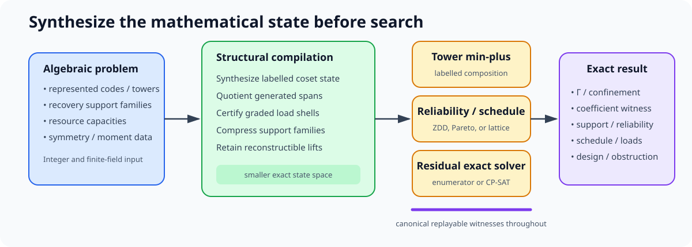

# ergodis

**Exact Recovery, Global Optimization, and Invariant Synthesis**

**Optimization and operations-research readers:** start with
[ergodis for optimization researchers](OPTIMIZATION.md). It explains the
mathematical results and solver design in optimization language and assumes no
coding-theory background.

ergodis is a compiler and exact solver for finite algebraic optimization
problems whose raw combinatorial state admits a much smaller mathematically
derived quotient. Its Rust library provides kernels for linear-code recovery,
hierarchical composition, capacitated scheduling, and finite algebraic search.
It compiles functional labels, conserved gradings, generated spans, symmetries,
and reconstructible coefficient blocks before optimization.

Every successful computation returns more than an optimum. Library answer
types, and their CLI JSON representations, retain helper choices, resource
loads, intermediate labels, coefficient lifts, support families, or replayable
obstructions. ergodis is specialized for algebraically structured finite
domains; it is not a general-purpose constraint-programming replacement.

“Invariant synthesis” means constructing the exact labelled cost state needed
by later composition; it does not mean conjecturing new mathematical
invariants.

## Scope and limits

ergodis is designed for exact finite problems with exploitable linear,
quotient, symmetry, span, syndrome, orbit, or repeated-interface structure. It
is most useful when many raw assignments collapse to a much smaller exact state
and an original-space witness must be reconstructed.

It is less suitable when arbitrary side constraints, continuous variables, or
strong linear relaxations dominate the model, or when no compact algebraic
state is known. It does not model repair bandwidth, network timing, GPU
execution, or storage-system dynamics unless those quantities are explicitly
encoded in the finite input. CP-SAT, MILP, flow, or decision-diagram solvers may
remain the right backend or the better standalone tool. The
[optimization guide](OPTIMIZATION.md#scope-and-limits) gives the detailed
crossover criteria.



## Use as a Rust library

The crate is the primary integration surface. The `ergodis` executable calls
the same public APIs and provides JSON interfaces for examples, shell workflows,
and independent replay.

Add the crate from its repository, or by path after cloning it:

```toml
[dependencies]
ergodis = { git = "https://github.com/tavisrudd/ergodis" }
```

Enable `features = ["parallel"]` when independent subproblems are large enough
to benefit from Rayon. Sequential execution remains available and avoids the
parallel setup cost on small instances.

This example compiles a binary two-block cost table and queries an exact cost
with its minimizing local labels:

```rust
use ergodis::{CompositionTable, CostTable, Matrix};

fn main() -> Result<(), Box<dyn std::error::Error>> {
    let zero = Matrix::new::<2>(1, 1, vec![0])?;
    let one = Matrix::new::<2>(1, 1, vec![1])?;
    let inner = CostTable::from_entries::<2>(
        1,
        1,
        [(zero, 0), (one.clone(), 1)],
    )?;
    let blocks = [one.clone(), one.clone()];
    let compiled = CompositionTable::compose::<2>(&blocks, &inner)?;
    let answer = compiled.answer::<2>(&one)?.expect("reachable label");

    assert_eq!(answer.cost, 1);
    assert_eq!(answer.local_labels.len(), 2);
    Ok(())
}
```

Run the checked version as `cargo run --release --example library_composition`.

The main library surfaces are:

| API                                                   | Use it for                                                      |
| :---------------------------------------------------- | :-------------------------------------------------------------- |
| `CostTable`, `CompositionTable`, `CompositionTower`   | labelled min-sum composition and expanded tower witnesses       |
| `compile_binary_*`, `confinement_*`, contextual plans | recovery profiles, confinement certificates, and context caches |
| scheduler functions and workspaces                    | capacitated and coefficient-weighted simultaneous recovery      |
| span, orbit, incidence, and projective modules        | compiled finite-field and symmetry-reduced search               |
| `SmallField`, `Matrix::null_space_*`                  | runtime GF(p^h) arithmetic and field-presentation-bound kernels  |
| `CompiledBinaryLinearCode`                           | exact minimum nonzero weight for small-rank binary row spaces    |
| binary commutant and invariant-split compiler         | verified module blocks beyond coordinate-orbit reduction         |
| `CompiledCssDistance`                                 | exact bounded CSS distance from connected-support elimination    |
| application types and functions                       | worked storage, sparse-code, and dependent-task models          |

Generate the complete API documentation with:

```text
cargo doc --all-features --open
```

The crate is at version 0.1.0; lower-level interfaces may still evolve.

Generated-span compilation is resource-bounded by default. Use
`GeneratedSpanTable::build_bounded` with `SpanBuildLimits` when an application
needs a different projective-column, state, retained-matrix, or transition
budget. Exhausting a budget returns a typed `SpanError::ResourceLimit`; it does
not rely on allocation failure or panic as flow control.

## Build and use the CLI

ergodis requires Rust 1.87 or later.

```text
cargo install --path . --features parallel
ergodis --help
```

For a repository-local build:

```text
cargo build --release --all-features
./target/release/ergodis --help
```

## Start here

For component ownership, trust boundaries, and the distinction between current
and accepted campaign architecture, see [DESIGN.md](DESIGN.md). The mathematical
compiler model is explained in [OPTIMIZATION.md](OPTIMIZATION.md), protocol
details in [CONTROL_PROTOCOL.md](CONTROL_PROTOCOL.md), and measurement scope in
[BENCHMARKS.md](BENCHMARKS.md).

The bundled inputs exercise the main workflows:

```text
# Expose equal scalar recovery costs but different exact GF(4) transfer costs.
ergodis transfer --input examples/data/f4-scalar-separation.json

# Analyze and replay an arbitrary-rank target subspace.
ergodis transfer-subspace --input examples/data/transfer-subspace.json

# Compose labelled costs through a hierarchy and expand its witness tree.
ergodis transfer-tower --input examples/data/transfer-tower.json

# Maximize simultaneous repairs under resource capacities.
ergodis schedule --input examples/data/schedule.json

# Run a storage application example.
ergodis application --input examples/data/ceph-repair.json
```

Every command accepts `--input -` for JSON on standard input and writes JSON to
standard output. Invalid dimensions, unsupported fields, exhausted candidate
or witness budgets, and inconsistent algebraic data fail closed with a
nonzero exit status.

For example, the bundled scheduling input returns the complete assignment,
aggregate loads, selected backend, and auditable work counters:

```json
{
  "repaired_count": 2,
  "complete": true,
  "assignment": [
    { "demand": 0, "loads": [0, 1] },
    { "demand": 1, "loads": [1, 0] }
  ],
  "total_loads": [1, 1],
  "backend": "dense-lattice",
  "transitions_examined": 8
}
```

## Commands

| command             | use                                                                 |
| :------------------ | :------------------------------------------------------------------ |
| `compose`           | compose an existing labelled cost table through one outer layer     |
| `transfer`          | derive exact rank-one transfer data from represented inner encoders |
| `transfer-subspace` | analyze an explicit normalized target subspace of arbitrary rank    |
| `transfer-tower`    | compile through several layers and replay coefficient witnesses     |
| `schedule`          | optimize alternative recovery systems under resource capacities     |
| `application`       | run a tagged storage, repair-DAG, QC-LDPC, vector, or GPU model     |

Use `ergodis <command> --help` for command-specific options. The input schemas
are represented by complete examples in `examples/data/`; these are also used
by the end-to-end CLI tests.

Long-running experimental campaigns may opt into the `control-plane` feature.
Its bounded Unix-socket protocol, language-neutral fixture, and dependency-free
Python binding are documented in [CONTROL_PROTOCOL.md](CONTROL_PROTOCOL.md).
Ordinary solves do not compile this layer or pay its search-path costs.

The separate `css_distance_native` binary consumes sparse physical checks,
logical observations, verified coordinate-orbit anchors, and an optional
incumbent support. It independently replays the incumbent and exhaustively
closes every smaller connected-support class. `--rounds` reuses the compiled
residual-syndrome filters; `--evidence` writes one create-only JSONL record.
`--compiled-out` creates a versioned, checksummed filter artifact, and
`--compiled-in` reloads it only when its cryptographic source fingerprint
matches the supplied matrices. Artifact and evidence output never overwrite.
Compatible older payloads remain readable across internal layout-width changes;
in particular, large-CSS version-1 artifacts are migrated by rebuilding the
sparse search state and reusing their source-bound completion filters.
With the `parallel` feature, `--threads N` statically partitions anchors across
workers with disjoint DFS workspaces and deterministic post-join reduction.
On Linux, `--worker-cpus` accepts one unique CPU ID per worker and pins the
Rayon pool in worker-index order; affinity startup is verified before search.
Direct optimization uses parity-aware iterative deepening and anchor-level
Young-Brothers-Wait. Rare verified bound improvements use cache-line-separated
worker mailboxes; `--pulse-interval` controls coarse polling without adding
per-support synchronization.

Large portfolio instances require the same feature-complete release build used
for their evidence runs:

```sh
cargo build --release --features large-css,parallel --bin css_distance_native
```

For multi-hour proof campaigns, the opt-in `campaign` profile retains release
optimization while enabling integer overflow checks:

```sh
cargo build --profile campaign --features large-css,parallel --bin css_distance_native
```

Ordinary application and benchmark builds continue to use `release`; campaign
evidence should record which profile produced the executable.

Without `large-css`, the binary rejects instances above 384 coordinates or
physical rank 192; without `parallel`, `--threads` cannot exceed one. Long
exhaustions can be split into deterministic, thread-count-independent pieces
with `--shard-index I --shard-count N`. Run every `I` in `0..N` with identical
input, maximum weight, anchors, and binary semantics. Each JSON record is marked
`partial-shard`; only the best witness across all `N` successful records, or
exhaustion by all `N`, supports a global claim. Shards may run in any order, on
different machines, and survive session boundaries independently. Maintainers
can compile every supported CSS feature combination and replay the compact/wide
shard-union regression with `scripts/check-css-feature-matrix.sh`.

Version-6 shard evidence additionally records a completion marker plus BLAKE3
fingerprints of the exact input and executable. Each shard also recomputes a
cold, per-anchor commitment to the common deterministic prefix frontier. Its
selected bucket carries a branch count and independent additive/XOR
accumulators over BLAKE3 branch identities. The cold-path
`css_distance_shard_ledger` tool accepts one record per shard and emits a
create-only compact coverage manifest only when every index is present exactly
once and the schema, input, executable, compiled artifact, search kernel,
requested and effective search maxima, completed rounds, and final-round
counters agree. The v3 ledger reconstructs every full anchor-partition digest
from the selected buckets, so executable identity is no longer the only
evidence that the shards name the same frontier. It records both maxima because
a search may normalize an odd requested maximum down by one; the cover verdict
is scoped to the recorded effective maximum. Missing, duplicate, interrupted,
mutated, cross-anchor, or mixed records fail closed:

```sh
cargo run --release --bin css_distance_shard_ledger -- \
  shard-*.json --output coverage.json
```

The `parallel`-gated `css_distance_random` companion searches for an upper
certificate by random information sets. It row-reduces the physical parity
checks under deterministic random coordinate orders, inspects the induced
systematic kernel basis, and optionally combines pairs among the lightest rows
with bounded order-2 OSD. Worker matrices, permutations, packed kernel rows,
logical values, ordering arrays, pivot maps, and witness scratch are pre-sized;
a trial allocates nothing, including when it discovers a witness. The optional
`--best-effort` mode exhausts its assigned trials and retains the lightest
verified witness seen even when that witness is above `--target-weight`.
`--seed`, `--trials`, `--threads`, `--osd-order`, and `--osd-window` are
explicit, and `--evidence` writes one
create-only, source-hashed JSON record. This is a witness finder, not a lower-
bound procedure; exactness still comes from `css_distance_native` exhaustion.

The library-level `ergodis::bp_osd` module provides a second reusable candidate
backend: sparse normalized-min-sum belief propagation followed by OSD-0,
bounded combination sweep, or bounded exhaustive OSD. One immutable compiled
parity-check matrix can be shared by independent aligned worker workspaces;
typed solves allocate nothing after setup. A returned
`syndrome_satisfied = true` certifies only the supplied binary equation. It is
an upper-bound witness, never a minimum-distance or proof-authority claim, and
applications must independently replay any additional logical observable.

`binary_linear_distance` is the corresponding exact small-rank row-space mode.
Its sparse JSON input contains `label`, `coordinate_count`, and `generators`;
the output gives the minimum nonzero weight and a replayable support. It uses a
canonical GF(2) basis and allocation-free packed Gray-code enumeration for
small spans.  At rank 24 and above, compilation also seeks disjoint systematic
information sets; a conservative candidate-cost model selects an exact
Brouwer--Zimmermann fixed-weight enumeration only when its proved lower bound
is predicted to beat Gray by at least 8x.  Both hot kernels dispatch once to a
POPCNT/AVX2/BMI implementation when the host supports it.  The evidence names
the selected method and information-set count.  The CLI defaults to
`--maximum-rank 30` rather than silently launching an infeasible span; informed
callers may raise the budget up to the hard rank-63 limit.

Inputs with 257--320 coordinates dispatch to a separately monomorphized wide
backend. It preserves exact three-word syndromes, removes redundant check rows
for syndrome tracking while retaining the original sparse connectivity graph,
and applies precomputed odd-check neighborhood packings as exact lower bounds.
The compact hot layout is unchanged. Wide search branches on the first odd check
and uses a disjoint first-true chain over its incident coordinates, rather than
enumerating every connected boundary extension.  The retained official
BB `[[288,12,18]]` run closes the exact distance in about 2.6 seconds of warm
single-core search after a roughly 1.8-second compile.  The wide parallel path
uses the same cache-line-separated bound pulses and anchor-level
Young-Brothers-Wait.  Disjoint deeper seeds feed coarse work-stealing tasks;
the retained eight-thread median is about 0.39 seconds.  Wide compiled
artifacts persist the 21 MB completion-filter payload with the same
source-binding and checksum discipline; measured reload is about 12--25 ms.
On the 16-worker topology-selected mask `0-15`, stopping the exact greedy
packing proof as soon as it exceeds the remaining completion budget cut the
single-worker instruction count by 6.3% without changing the search tree. The
retained 16-worker median improved from 0.255602 to 0.234717 seconds (1.089x,
Welch t = 6.37 over independent 11-round samples), about 10.63x faster than
the retained 2.494941-second single-worker baseline. The portable binary now
multiversions the complete worker-local DFS once per coarse partition: on
x86-64 hosts supporting AVX2, BMI1/2, LZCNT, and POPCNT it selects the tuned
kernel, otherwise it retains the generic implementation. A 32-byte conflict
record avoids split dependent loads. The final retained 16-worker median is
0.177196 seconds, 1.325x faster than the post-cutoff portable kernel (Welch
t = 19.57). Replacing the full fail-first odd-check scan with exact first-odd
branching deliberately visits 24.1% more candidates but avoids all hot-path
option cardinalities. With a 4,096-candidate bound pulse, the retained median
is 0.169677 seconds: another 1.044x (Welch t = 2.99) and 14.70x against the
retained original single-worker run. Three subsequent exact cost reductions
replace a ceiling division by its multiplication predicate, defer five-word
child-state construction until after syndrome pruning, and derive each
worker's connected-support count from its candidate accumulator. They reduce
single-worker retired instructions by 7.36% and cycles by 4.27%. The retained
16-worker median is 0.164733 seconds (1.030x, Welch t = 3.21), or 15.15x
against the original single-worker run. Consolidating six depth-indexed
workspace vectors into one 192-byte frame removes five worker-setup
allocations and repeated hot indexing. The retained median falls again to
0.153666 seconds (1.072x, Welch t = 7.51), reaching 16.24x against the
original single-worker run.
On the same BB288 input and two verified translation anchors, an 8-thread
Gurobi binary-slack control remained unresolved after two 60-second orbit
limits (both lower bounds 13).  The retained Ergodis cached-cold exact run is
therefore more than 282x faster in time to proof on this protocol.

### Contextual-state library APIs

The Rust library exposes three exact shortcuts derived from the compositional
state theorem:

- `certify_rank_one_transfer_by_generators` decides whether every bounded
  recovery system through a supplied radius transfers completely. It checks
  the zero sector first, evaluates the target block first, prunes partial costs
  above the radius, and stops at the first obstruction. Use the full
  `confinement_by_generators` API when the exact losing nonzero-sector minimum
  is also required.
- `RankOneProbeCache` stores the zero-truncated projective line-probe profile
  lazily. It is intended for repeated compatible outer contexts over the same
  scalar-labelled inner state.
- `RankBoundedContextCache` decomposes a rank-`t` query into canonical outer
  functional-dual subspaces of dimension at most `t` and reuses exact results
  across contexts. It never merges differently labelled maps merely because
  they generate the same subspace.
- `context_cost` defaults to a safe one-query `Auto` forecast.
  `context_cost_cached` requests cache admission explicitly, while
  `context_cost_planned` accepts `Direct`, `Cached`, or a caller-supplied
  `Auto` forecast.
  `Auto` admits state only when the measured reuse threshold is met and a
  conservative query-cache estimate, including actual key width, fits the
  caller's byte budget; otherwise
  it executes the exact direct scan without mutating the cache. A context
  already complete in the cache is reused without a new admission, even when
  its fresh-query forecast would select direct execution.

The Rust hot scans use preallocated coefficient, label, elimination, and RREF
scratch. Persistent keys occupy one flat byte pool behind compact 16-byte
records and integer open-addressing slots; local table lookups consume slices,
so candidate enumeration does not allocate. Allocation is confined to
validation/setup, reserved state admission, and final witness materialization.

The two context caches currently specialize to scalar labels over the outer
field. A flattened base-field representation of a proper extension does not
carry enough information to recover extension-field scalar multiplication; a
future generalized API must receive that action explicitly.

### Exact fibre indexing

`compile_dense_fibres` builds a bounded CSR partition from one dense key per
source member. It retains every member of every fibre in source order using two
flat allocations; subsequent fibre scans are allocation-free. The API uses
distinct `FibreRepresentative` and `ExhaustiveFibre` types so selecting one
convenient preimage cannot be confused with establishing a predicate over the
entire equivalence class. `verify_dense_fibres` independently replays coverage,
uniqueness, and key membership against the source keys.

This is appropriate when a coarse modular, orbit, or signature quotient is
used to generate candidates but a later exact predicate is not proved constant
on quotient classes. If constancy is proved, callers may explicitly use a
representative; otherwise they must scan the exhaustive fibre or compile a
separately verified sufficient refinement.

### Parallel execution

`compose`, `transfer-tower`, and `schedule` accept `--parallel`. The worker
count defaults to the machine's available CPU count and can be bounded
explicitly:

```text
ergodis transfer-tower \
  --input examples/data/transfer-tower.json \
  --parallel --threads 8
```

Parallel execution requires the Cargo feature `parallel`. Small instances may
be faster sequentially; outputs and canonical witnesses are identical.

## Application examples

`ergodis application` accepts one tagged JSON document and returns the exact
application result together with a replayable witness, support family, or
obstruction and explicit work counters. The second column below states the
decision problem in operational terms; the third names the mathematical
reduction ergodis uses. These built-in applications are worked examples of the
solver's compilation model, not an exhaustive application catalogue or
separate general-purpose products.

| input `kind`     | exact question                                                   | principal reduction                              |
| :--------------- | :--------------------------------------------------------------- | :----------------------------------------------- |
| `ceph-xor`       | in distributed storage, list every minimal repair set            | shared decision graph for set families           |
| `azure-lrc`      | in cloud storage, serve the most losses within domain capacities | six recurring load types and capacity bounds     |
| `repair-dag`     | finish dependent repair tasks in the fewest capacity-safe slots  | equivalent ready-task sets plus capacity search  |
| `qc-ldpc`        | find a small failure-causing pattern in a repeated sparse code   | cyclic symmetry and graph components             |
| `vector-repair`  | find the fewest physical nodes whose symbols span the target     | merge identical generated node spans             |
| `gpu-checkpoint` | assign helpers without overloading nodes or rack links           | aggregate capacities, then construct the witness |

Additional examples:

```text
ergodis application --input examples/data/azure-repair-batch.json
ergodis application --input examples/data/repair-dag.json
ergodis application --input examples/data/qc-ldpc-search.json
ergodis application --input examples/data/vector-repair.json
ergodis application --input examples/data/gpu-checkpoint-recovery.json
```

The GPU front end solves the MDS/AEC recovery problem after placement is fixed;
it does not model GPU execution or checkpoint-copy overlap. The QC-LDPC front
end distinguishes trapping sets, which bound odd neighboring checks, from
stopping sets, which forbid neighboring checks of degree one.

## What ergodis computes

- prescribed-coset support costs and associative min--sum composition;
- exact finite confinement costs, including zero and nonzero functional
  sectors;
- coefficient-level recovery and tower witnesses;
- capacitated simultaneous repair with heterogeneous node, rack, link, or
  service limits;
- compressed minimal-support families, exact reliability counts, and
  scheduling views;
- generated-span optimization for vector and subpacketized repair; and
- orbit-, incidence-, and moment-structured finite-field searches.

Prime fields are statically dispatched; attempting to instantiate arithmetic
for a composite or zero `Prime<P>` modulus is a compile-time error, while
`Prime::validate` remains available to reject runtime-selected parameters.
Canonical polynomial-basis GF(4)
is supported by the public composition and transfer paths. Hot states use
compact contiguous representations; minimizing lifts are stored separately
from numerical labelled costs so witnesses can be propagated without bloating
the dynamic-programming state.

## Performance highlights

These are bounded exact comparisons, not universal solver rankings. Every
control reproduces the same exact support family, optimum, or feasibility
verdict, as applicable; timing includes input or model construction.

| workload                    | scale                                  | cold wall/solve       | cold speedup | warm-batch wall/solve | warm speedup |
| :-------------------------- | :------------------------------------- | :-------------------- | -----------: | :-------------------- | -----------: |
| Ceph XOR support family     | 8 diamonds, 256 minimal supports       | 3.014 / 101.628 ms    |       33.71x | 0.547 / 12.598 ms     |       22.94x |
| represented GF(4) tower     | depth 6, fanout 4; 4,096 leaves        | 4.559 ms / >400 s     |   >87,743.5x | 1.109 ms / >50 s      |   >45,103.0x |
| published Hamming-outer LRC | binary `[4095,2718,6;2]`               | 442.573 ms / 270.939 s|      657.88x | 254.452 ms / >50 s    |      >196.50x |
| GPU MDS checkpoint recovery | 10,000 shards, 6,000 data, 64 failures | 3.803 / 393.213 ms    |      102.42x | 0.682 / 70.449 ms     |      103.23x |

Each cell is `ergodis / control`. Cold samples run one solve per fresh process;
warm-batch samples run eight solves per fresh process on both sides and divide
external wall time by eight. The tower and warm Hamming controls exceeded the
400-second batch limit, so those entries are lower bounds. The cold Hamming
ratio is the median of three paired completed runs (`t = 49.09`).

See `BENCHMARKS.md` for all comparison tables, peak RSS, protocols,
architecture flags, profiling results, limits probes, and exact replay
commands. Corrected raw samples, summaries, and artifact hashes are in
`evidence/c985-application-readme-ab*` and
`evidence/c985-application-long-{cold,warm}*`.

## Mathematical and evidence scope

The companion paper, `../compositional_recovery.pdf`, proves the labelled
composition and transfer laws from which the recovery compiler is derived.
ergodis evaluates finite instances and returns replayable witnesses; neither
its executions nor its benchmarks are premises of those proofs. The Python
code in `python/` is an independent reference and evidence layer, not the
production solver.

## Validate

From this directory, using the repository Nix toolchain:

```text
nix shell nixpkgs#python3 --command python3 python/generate_fixtures.py --check
nix shell nixpkgs#cargo nixpkgs#rustc --command cargo fmt --check
nix shell nixpkgs#cargo nixpkgs#rustc nixpkgs#clippy --command \
  cargo clippy --all-targets --all-features -- -D warnings
nix shell nixpkgs#cargo nixpkgs#rustc --command cargo test --all-features
```

The test corpus includes exhaustive small-field checks, seeded property tests,
CLI workflows, GF(4) labelled-transfer witnesses, orbit and scheduling
certificates, and independent differential fixtures. Performance claims are
accepted only after exact output and witness parity.

## License

ergodis is distributed under the GNU Affero General Public License, version
3.0 (AGPL-3.0); see `LICENSE` in this directory. Contact the author for
commercial licensing.
